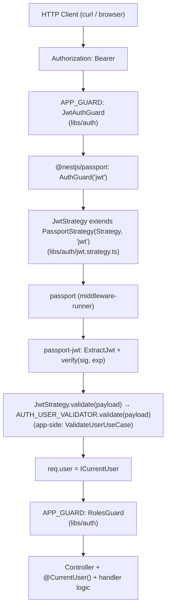
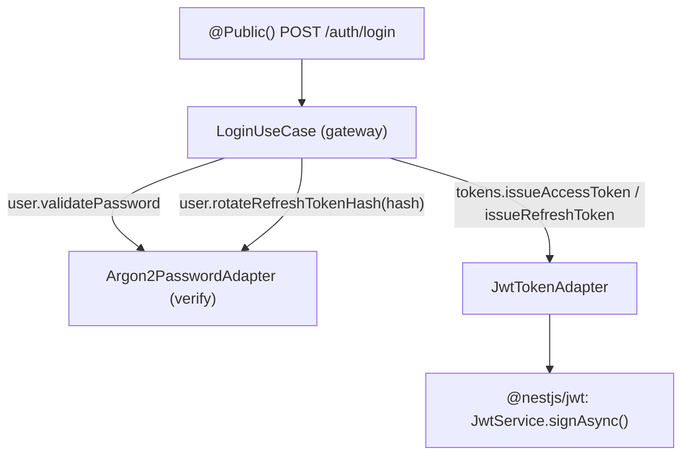

# Обзор auth-стека

> [!abstract] Кратко
> Auth-стек собран из **пяти** NPM-пакетов, играющих разные
> роли: `passport` — middleware-runner; `@nestjs/passport` —
> Nest-обёртка над ним (`PassportStrategy`, `AuthGuard`);
> `passport-jwt` — стратегия, которая умеет вытащить и
> верифицировать JWT; `@nestjs/jwt` — `JwtService`, которым
> подписываются access/refresh-токены на login/refresh; и
> `argon2` — хэширование паролей и refresh-token-hash'ей.
> Поверх них наш `libs/auth` добавляет `JwtAuthGuard`,
> `RolesGuard`, декораторы `@Public/@Roles/@CurrentUser` и
> порт `AUTH_USER_VALIDATOR`. Эта статья — карта того, кто
> кого зовёт на одном HTTP-запросе.

## Проблема, которую решает

Auth-стек — это пять разных пакетов с местами **сильно**
пересекающимися именами. Без карты их легко перепутать:
«passport» и «@nestjs/passport» звучат как одно и то же;
«passport-jwt» и «@nestjs/jwt» — обе про JWT, но делают
противоположные вещи. Эта статья отвечает на четыре
вопроса, которые должен уметь сходу ответить любой
мид-уровня NestJS-разработчик, поработавший с проектом:

1. Почему есть и `passport`, и `@nestjs/passport`?
2. Что делает `passport-jwt`, а что — `@nestjs/jwt`?
3. Где плагаются `JwtStrategy` и `JwtAuthGuard`?
4. На каких слоях сидит наш `libs/auth`, а на каких —
   gateway-app-side `modules/auth/`?

Если читать только [[jwt-and-rbac]], можно понять решения,
но не **поток**: как именно за бирами «JWT валиден» стоит
семь объектов, дёргающих друг друга. Эта статья — про поток.

## Слои стека сверху вниз

Auth-стек — это вертикальная цепочка адаптеров, в которой
каждый слой работает над более низким и **скрывает** его API
за чем-то более удобным. Картинка такая:



Параллельная (не-нарисованная) ветка — выпуск токенов в
`POST /auth/login` и `POST /auth/refresh`:



На login'е работают `argon2` и `@nestjs/jwt`, на каждом
authenticated-запросе — `@nestjs/passport` + `passport` +
`passport-jwt`. Эти два потока пересекаются только в одной
точке: `JwtTokenAdapter.verifyRefresh()` использует
`JwtService.verifyAsync()` (т.е. `@nestjs/jwt` для проверки
**refresh**-JWT). Все остальные verify'ы — passport-jwt.

### Слой 1 — `Authorization: Bearer <jwt>`

Низкоуровневый «вход» в стек. Клиент кладёт access-JWT в
заголовок `Authorization`, формат — RFC 6750
(`Bearer <token>`). Этот заголовок и есть единственный
input всей цепочки на authenticated-маршрутах.

### Слой 2 — `JwtAuthGuard` (libs/auth)

`libs/auth/jwt-auth.guard.ts`
([GitHub](https://github.com/eugesher/retail-inventory-system/blob/84b1507c68fd9ee02b185eef3c4594b6fe02f664/libs/auth/jwt-auth.guard.ts#L11-L31)).
Зарегистрирован в `app.module.ts` через `APP_GUARD`
([GitHub](https://github.com/eugesher/retail-inventory-system/blob/84b1507c68fd9ee02b185eef3c4594b6fe02f664/apps/api-gateway/src/app/app.module.ts#L26-L29)).
Первый, кого вызывает Nest для каждого маршрута.

Делает три вещи:

1. Через `Reflector` ищет на handler'e/class'e метаданные
   `IS_PUBLIC_KEY` (выставляются `@Public()`).
2. Если public → `return true` (стек дальше не выполняется,
   `req.user === undefined`).
3. Если не public → делегирует в `super.canActivate(context)`
   — а это уже `AuthGuard('jwt')` из `@nestjs/passport`.

Зачем эта обёртка вокруг `AuthGuard('jwt')`? Чтобы добавить
`@Public()`-short-circuit. Стандартный `AuthGuard` про
`@Public()` ничего не знает — это наша конвенция.

### Слой 3 — `@nestjs/passport: AuthGuard('jwt')`

Класс `AuthGuard('jwt')` — фабрика guard'ов из
`@nestjs/passport` ([[lib-nestjs-passport]]). Аргумент
`'jwt'` — это **имя стратегии** (мы его назначили в
`PassportStrategy(Strategy, 'jwt')`). Делает:

1. Поднимает Passport-middleware из пула.
2. Запускает его, передавая на вход *запрос* и название
   стратегии.
3. По результату passport-middleware либо `return true`
   (стратегия успешно вернула `user`) → Nest продолжает
   pipeline; либо бросает `UnauthorizedException` → 401.

`@nestjs/passport` сам по себе **не выбирает** стратегию и
**не делает** verify — он только мост между
Nest-execution-context'ом и Passport-middleware'ом.

### Слой 4 — `passport` middleware-runner

`passport` ([[lib-passport]]) — оригинальная Express-
библиотека от 2011 года. Внутри неё — реестр стратегий и
машинерия, которая на каждый запрос:

- выбирает зарегистрированную стратегию по имени;
- зовёт `strategy.authenticate(req)`;
- кладёт результат в `req.user`, либо вызывает `next(err)`.

Это **не** библиотека «про JWT» или «про OAuth» — это
*runner*, который запускает любую стратегию, которую ему
дали. Сами стратегии — отдельные пакеты (`passport-jwt`,
`passport-local`, `passport-google-oauth20`, …). У нас
зарегистрирована одна — `'jwt'` — через `JwtStrategy`.

### Слой 5 — `passport-jwt: ExtractJwt + verify`

`passport-jwt` ([[lib-passport-jwt]]) реализует
`Strategy`-класс, который умеет:

- **извлечь** JWT из request'а (мы используем
  `ExtractJwt.fromAuthHeaderAsBearerToken()`);
- **верифицировать** подпись против `secretOrKey`;
- **проверить** `exp` (если `ignoreExpiration: false`);
- передать **уже-декодированный payload** в callback
  `validate(payload, done)`.

Наш `JwtStrategy` (см. ниже) расширяет именно этот
`passport-jwt`-Strategy через `PassportStrategy(Strategy, 'jwt')`.

### Слой 6 — `JwtStrategy.validate(payload)`

`libs/auth/jwt.strategy.ts`
([GitHub](https://github.com/eugesher/retail-inventory-system/blob/84b1507c68fd9ee02b185eef3c4594b6fe02f664/libs/auth/jwt.strategy.ts#L10-L29)):

```typescript
@Injectable()
export class JwtStrategy extends PassportStrategy(Strategy, 'jwt') {
  constructor(
    configService: ConfigService,
    @Inject(AUTH_USER_VALIDATOR) private readonly userValidator: IAuthUserValidator,
  ) {
    super({
      jwtFromRequest: ExtractJwt.fromAuthHeaderAsBearerToken(),
      ignoreExpiration: false,
      secretOrKey: configService.get<string>('JWT_ACCESS_SECRET')!,
    });
  }

  public async validate(payload: IJwtAccessPayload): Promise<ICurrentUser> {
    return this.userValidator.validate(payload);
  }
}
```

Тут хитрая, но важная деталь: класс **наследуется** от
mixin'а `PassportStrategy(Strategy, 'jwt')`. На что это
смотрит:

- `Strategy` — это `passport-jwt.Strategy` (его передали
  первым аргументом).
- `'jwt'` — имя, под которым его зарегистрируют в Passport-
  registry'е.
- `PassportStrategy(...)` (из `@nestjs/passport`) — mixin,
  который оборачивает `Strategy` так, чтобы:
  1. сделать его Nest-`@Injectable()` (т.е. зарегистрировать
     в DI);
  2. распознать `validate()`-метод нашего класса и сделать
     его callback'ом passport'а.

К моменту, когда наш `validate(payload)` зовётся,
`passport-jwt` уже:

- извлёк токен из header'а;
- сверил подпись по `JWT_ACCESS_SECRET`;
- проверил `exp`.

Если что-то из этого упало — `validate()` **не запустится**,
будет 401. Поэтому в `validate()` мы решаем только тот
вопрос, который passport-jwt сам не может: «существует ли
такой user в БД и активен ли он?».

### Слой 7 — `AUTH_USER_VALIDATOR` port (libs/auth → app)

`libs/auth` не знает про БД и про User. Чтобы strategy
смогла спросить «активен ли пользователь?», она требует
imp'а интерфейса `IAuthUserValidator`:

```typescript
// libs/auth/auth-user-validator.port.ts
export const AUTH_USER_VALIDATOR = Symbol('AUTH_USER_VALIDATOR');

export interface IAuthUserValidator {
  validate(payload: IJwtAccessPayload): Promise<ICurrentUser>;
}
```

> [GitHub: libs/auth/auth-user-validator.port.ts](https://github.com/eugesher/retail-inventory-system/blob/84b1507c68fd9ee02b185eef3c4594b6fe02f664/libs/auth/auth-user-validator.port.ts#L1-L10)

Это **порт** в hexagonal-смысле ([[hexagonal-architecture]]):
интерфейс, который lib требует, но не реализует.

Gateway-side `modules/auth/infrastructure/auth.module.ts`
делает binding:

```typescript
// apps/api-gateway/src/modules/auth/infrastructure/auth.module.ts
const authLibProviders = [
  UserTypeormRepository,
  { provide: USER_REPOSITORY, useExisting: UserTypeormRepository },
  ValidateUserUseCase,
  { provide: AUTH_USER_VALIDATOR, useExisting: ValidateUserUseCase },
];
```

> [GitHub: apps/api-gateway/src/modules/auth/infrastructure/auth.module.ts](https://github.com/eugesher/retail-inventory-system/blob/84b1507c68fd9ee02b185eef3c4594b6fe02f664/apps/api-gateway/src/modules/auth/infrastructure/auth.module.ts#L26-L40)

`useExisting` (не `useClass`) — важная деталь: это значит,
`ValidateUserUseCase` сам **уже** зарегистрирован, и под
DI-токеном `AUTH_USER_VALIDATOR` просто переиспользуется
тот же singleton. Без `useExisting` мы бы получили **две**
независимые инстанции (которые не дрались бы, но дублировали
бы DI-граф). См. [[shared-libs-philosophy]] §«binding
patterns» о том, как это применяется в других стеках
(STOCK_CACHE, ORDER_REPOSITORY и т.д.).

### Слой 8 — `ValidateUserUseCase` (gateway-side `application/`)

```typescript
// apps/api-gateway/src/modules/auth/application/use-cases/validate-user.use-case.ts
@Injectable()
export class ValidateUserUseCase implements IAuthUserValidator {
  constructor(@Inject(USER_REPOSITORY) private readonly users: IUserRepositoryPort) {}

  public async validate(payload: IJwtAccessPayload): Promise<ICurrentUser> {
    const user = await this.users.findById(payload.sub);
    if (!user?.isActive) {
      throw new UnauthorizedException('Account is no longer active');
    }

    return {
      id: user.id,
      email: user.email,
      roles: user.roles.map((role) => role.value),
    };
  }
}
```

> [GitHub: apps/api-gateway/src/modules/auth/application/use-cases/validate-user.use-case.ts](https://github.com/eugesher/retail-inventory-system/blob/84b1507c68fd9ee02b185eef3c4594b6fe02f664/apps/api-gateway/src/modules/auth/application/use-cases/validate-user.use-case.ts#L8-L24)

Здесь `User`-aggregate загружается через
`IUserRepositoryPort` (см. [[mappers-and-repositories]]). Если
`user.isActive` false (`deletedAt !== null`) — 401. На
выход — `ICurrentUser` (id, email, roles), который passport
положит в `req.user`.

### Слой 9 — `req.user` и `@CurrentUser()`

К этому моменту passport-middleware (через цепочку
@nestjs/passport → JwtStrategy.validate → ValidateUserUseCase)
проставил `req.user` в форме `ICurrentUser`. Дальше Nest
запускает следующий guard — `RolesGuard`.

`@CurrentUser()` — это `createParamDecorator`, который
читает `request.user`:

```typescript
// libs/auth/current-user.decorator.ts
export const CurrentUser = createParamDecorator(
  (_data: unknown, ctx: ExecutionContext): ICurrentUser | undefined => {
    const request: IRequestWithUser = ctx.switchToHttp().getRequest<IRequestWithUser>();
    return request.user;
  },
);
```

> [GitHub: libs/auth/current-user.decorator.ts](https://github.com/eugesher/retail-inventory-system/blob/84b1507c68fd9ee02b185eef3c4594b6fe02f664/libs/auth/current-user.decorator.ts#L9-L14)

Простой read с типизацией. Inject'ится в параметр handler'а.

### Слой 10 — `RolesGuard`

`libs/auth/roles.guard.ts`
([GitHub](https://github.com/eugesher/retail-inventory-system/blob/84b1507c68fd9ee02b185eef3c4594b6fe02f664/libs/auth/roles.guard.ts#L13-L41)).
Зарегистрирован после `JwtAuthGuard` в том же `app.module.ts`.

Сверяет `request.user.roles` со списком `@Roles(...)` (на
handler'е или class'е). Если `@Roles` нет на маршруте —
guard молча пропускает (значит «требуется только
аутентификация»). Если есть — `some()`-проверка, и при
провале **403 Forbidden** (а не 401).

### Слой 11 — Controller-handler

Самый верхний слой. К этому моменту:

- `req.user` уже set;
- `@CurrentUser()` сейчас вытащит `ICurrentUser`;
- хендлер запускается с полностью валидированной
  request-state'ой.

## Параллельный flow — выпуск токенов

`POST /auth/login` и `POST /auth/refresh` — единственные
`@Public()` endpoint'ы. Их flow выглядит **иначе** —
passport-стек на них не запускается.

### Login

```typescript
// apps/api-gateway/src/modules/auth/application/use-cases/login.use-case.ts
    const passwordValid = await user.validatePassword(command.password, this.hasher);
    if (!passwordValid) {
      this.logger.warn({ userId: user.id, email }, 'LoginFailed: bad password');
      throw new UnauthorizedException('Invalid credentials');
    }

    const accessJti = randomUUID();
    const refreshJti = randomUUID();
    const roles = user.roles.map((role) => role.value);

    const accessToken = await this.tokens.issueAccessToken({
      sub: user.id, email: user.email, roles, jti: accessJti,
    });
    const refreshToken = await this.tokens.issueRefreshToken({
      sub: user.id, jti: refreshJti,
    });

    user.rotateRefreshTokenHash(await this.hasher.hash(refreshToken));
    user.recordLoggedIn();
    await this.users.save(user);
```

> [GitHub: apps/api-gateway/src/modules/auth/application/use-cases/login.use-case.ts](https://github.com/eugesher/retail-inventory-system/blob/84b1507c68fd9ee02b185eef3c4594b6fe02f664/apps/api-gateway/src/modules/auth/application/use-cases/login.use-case.ts#L34-L57)

Здесь работают **другие** пакеты:

1. **`argon2`** (`Argon2PasswordAdapter.verify`) — сверяет
   пароль с хэшем в БД ([[lib-argon2]]).
2. **`@nestjs/jwt`** (`JwtService.signAsync` через
   `JwtTokenAdapter`) — подписывает access и refresh-JWT
   ([[lib-nestjs-jwt]]).
3. **`argon2.hash`** — повторно, чтобы взять argon2-хэш от
   **refresh-токена** и положить его в `user.refresh_token_hash`.

Passport, `@nestjs/passport`, `passport-jwt` — **не
участвуют**. Это симметричное наблюдение: они нужны для
**проверки** входящих JWT, не для **выпуска**.

### `JwtTokenAdapter` (gateway-side)

```typescript
// apps/api-gateway/src/modules/auth/infrastructure/jwt/jwt-token.adapter.ts
@Injectable()
export class JwtTokenAdapter implements ITokenPort {
  private readonly accessExpiresIn: string;
  private readonly refreshExpiresIn: string;
  private readonly refreshSecret: string;

  constructor(
    private readonly jwtService: JwtService,
    configService: ConfigService,
  ) {
    this.accessExpiresIn = configService.get<string>('JWT_ACCESS_EXPIRES_IN', '15m');
    this.refreshExpiresIn = configService.get<string>('JWT_REFRESH_EXPIRES_IN', '7d');
    this.refreshSecret = configService.get<string>('JWT_REFRESH_SECRET')!;
  }

  public issueAccessToken(payload: Omit<IJwtAccessPayload, 'iat' | 'exp'>): Promise<string> {
    return this.jwtService.signAsync(payload, {
      expiresIn: this.accessExpiresIn as JwtSignOptions['expiresIn'],
    });
  }

  public issueRefreshToken(payload: Omit<IJwtRefreshPayload, 'iat' | 'exp'>): Promise<string> {
    return this.jwtService.signAsync(payload, {
      secret: this.refreshSecret,
      expiresIn: this.refreshExpiresIn as JwtSignOptions['expiresIn'],
    });
  }

  public verifyRefresh(token: string): Promise<IJwtRefreshPayload> {
    return this.jwtService.verifyAsync<IJwtRefreshPayload>(token, { secret: this.refreshSecret });
  }
  // …
}
```

> [GitHub: apps/api-gateway/src/modules/auth/infrastructure/jwt/jwt-token.adapter.ts](https://github.com/eugesher/retail-inventory-system/blob/84b1507c68fd9ee02b185eef3c4594b6fe02f664/apps/api-gateway/src/modules/auth/infrastructure/jwt/jwt-token.adapter.ts#L28-L58)

`JwtService` — Nest-DI-friendly обёртка над `jsonwebtoken`,
которую регистрирует `JwtModule.registerAsync` в
`libs/auth/auth.module.ts`. `JwtService` сконфигурирован с
`JWT_ACCESS_SECRET` по умолчанию. Для refresh — в каждом
вызове `signAsync()` мы передаём **переопределение** secret'а
(`secret: this.refreshSecret`), что и даёт нам два секрета
из одного `JwtService`-инстанса.

`verifyRefresh()` (вторая половина адаптера) — единственное
место в проекте, где `@nestjs/jwt` верифицирует, а не
подписывает. Это используется только в
`RefreshTokenUseCase`. На обычных authenticated-запросах
verify делает passport-jwt, не `@nestjs/jwt`.

### Refresh

`POST /auth/refresh` смешивает обе ветки:

```typescript
// apps/api-gateway/src/modules/auth/application/use-cases/refresh-token.use-case.ts
    let payload: IJwtRefreshPayload;
    try {
      payload = await this.tokens.verifyRefresh(command.refreshToken);
    } catch (error: unknown) {
      // …
      throw new UnauthorizedException('Invalid refresh token');
    }

    const user = await this.users.findById(payload.sub);
    // …
    const matches = await this.hasher.verify(user.refreshTokenHash, command.refreshToken);
    if (!matches) {
      // Rotation reuse: token was already exchanged.
      user.rotateRefreshTokenHash(null);
      await this.users.save(user);
      throw new UnauthorizedException('Invalid refresh token');
    }

    // …
    const refreshToken = await this.tokens.issueRefreshToken({ sub: user.id, jti: refreshJti });

    user.rotateRefreshTokenHash(await this.hasher.hash(refreshToken));
    await this.users.save(user);
```

> [GitHub: apps/api-gateway/src/modules/auth/application/use-cases/refresh-token.use-case.ts](https://github.com/eugesher/retail-inventory-system/blob/84b1507c68fd9ee02b185eef3c4594b6fe02f664/apps/api-gateway/src/modules/auth/application/use-cases/refresh-token.use-case.ts#L21-L65)

Внутри одного use-case'а:

1. **`@nestjs/jwt`** — `verifyRefresh()` декодирует JWT и
   проверяет подпись по `JWT_REFRESH_SECRET`.
2. **`argon2`** (verify) — сверяет, что **этот конкретный
   refresh** — тот, который мы выпустили последним (а не
   уже обменянный).
3. **`@nestjs/jwt`** + **`argon2`** (повторно) — выпуск
   новой пары и хэширование нового refresh'а.

См. [[jwt-and-rbac]] §«Refresh-token rotation reuse-detection
в действии» для деталей того, что происходит, когда
`matches === false`.

## Что предоставляет каждый слой и чего не предоставляет

| Слой | Делает | Не делает |
|------|--------|-----------|
| `passport` | Запускает middleware-цепочку стратегий; кладёт `req.user`. | Не знает про JWT/OAuth/SAML — это стратегии. |
| `@nestjs/passport` | `PassportStrategy()`-mixin + `AuthGuard(name)` для Nest-DI. | Не реализует стратегий; не делает verify. |
| `passport-jwt` | Извлекает JWT из request'а + verify-подпись + проверка `exp` + decode. | Не выпускает токены. Не знает про БД. |
| `@nestjs/jwt` | `JwtService.signAsync/verifyAsync` — выпуск и (опционально) проверка JWT. | Не достаёт JWT из request-header'а; не выстраивает middleware. |
| `argon2` | `argon2.hash / verify` для паролей и refresh-hash'ей. | Не имеет отношения к JWT. |
| `libs/auth` | `JwtAuthGuard`, `RolesGuard`, декораторы, порт `AUTH_USER_VALIDATOR`, `forRootAsync`-конфиг. | Не знает про `User`-сущность, БД, домен. |
| `app-side modules/auth/` | `User`-aggregate, repository, use-cases, controller, password+token-adapter'ы. | Не определяет JWT-, passport-механики. |

Эта таблица — самая полезная suммаризация при чтении статьи.

## Что предоставляет проект сверху

Stack из пяти NPM-пакетов — это сырая база. `libs/auth` поверх
неё добавляет соглашения проекта:

1. **`@Public()`-конвенция.** В сыром `@nestjs/passport` нет
   опт-аута: ты либо `AuthGuard('jwt')` на route, либо нет.
   `JwtAuthGuard` обходит это через `IS_PUBLIC_KEY`-
   metadata-key.
2. **RBAC.** Сам по себе passport/passport-jwt про роли
   ничего не знает — он кладёт `req.user`, а дальше ваше
   дело. `RolesGuard` + `@Roles(...)` + `RoleEnum` — это
   надстройка, которой нет в чужих экосистемах в готовом
   виде.
3. **Порт `AUTH_USER_VALIDATOR`.** `passport-jwt`-callback
   `validate(payload)` обычно подразумевает прямое чтение
   user'а внутри стратегии — что **сразу** сшивает
   strategy с persistence. Наш порт это разрывает; libs/auth
   остаётся framework-glue.
4. **Декораторы из одной точки.** `@Public`, `@Roles`,
   `@CurrentUser` экспортируются из `@retail-inventory-system/auth`.
   Один import — нет «угадайте, откуда брать декоратор для
   аутентификации».
5. **Конвенции вокруг `RoleEnum`.** Source-of-truth в
   `libs/contracts/auth` (framework-free → future-микросервисам
   с авторизацией на их стороне будет легко импортироваться,
   не таща Nest); runtime-re-export в `libs/auth/role.enum.ts`.

## Где импорты могут жить, а где — нет

Boundaries-правила (ADR-017, [[shared-libs-philosophy]]) для
auth-стека такие:

- **`passport`, `passport-jwt`, `@nestjs/passport`, `@nestjs/jwt`,
  `argon2`** — могут импортироваться **только** внутри:
  - `libs/auth/` (`@nestjs/passport`, `@nestjs/jwt`,
    `passport-jwt`);
  - `apps/api-gateway/src/modules/auth/infrastructure/`
    (`@nestjs/jwt` через `JwtTokenAdapter`; `argon2` через
    `Argon2PasswordAdapter`).
- **`libs/contracts/auth`** — может импортироваться отовсюду
  (он framework-free): из libs/auth, из gateway-app-side,
  из любого будущего микросервиса, который проверяет JWT.
- **Domain-слой** (`apps/api-gateway/src/modules/auth/domain/`)
  — **не** импортирует ни `@nestjs/*`, ни `passport*`, ни
  `argon2`. Доступ к паролю — через
  `IPasswordHasher`-интерфейс (см. `user.model.ts`), к
  токенам — никак (user-aggregate про токены не знает; он
  знает только про `refresh_token_hash`).

Это даёт нам hexagonal-clean layering: домен `User` можно
unit-test'ить без NestJS-test-module'а; libs/auth можно
переиспользовать в будущих микросервисах без gateway-
персистентности.

## Связанные решения

- [[jwt-and-rbac]] — концептуальная статья: что мы решили
  и почему. Эта — про **как** оно бежит.
- [[lib-nestjs-passport]], [[lib-passport]],
  [[lib-passport-jwt]], [[lib-nestjs-jwt]], [[lib-argon2]] —
  по одной статье на пакет. Здесь — суммарная картина.
- [[hexagonal-architecture]] — `AUTH_USER_VALIDATOR` и
  `USER_REPOSITORY` как образцовые порты.
- [[shared-libs-philosophy]] — почему `libs/auth` Nest-glue,
  а `libs/contracts/auth` framework-free.
- [[api-gateway-pattern]] — где gateway, и почему именно
  он хост `modules/auth/`.

## Глоссарий

| Термин (EN) | Перевод / пояснение (RU) |
|---|---|
| Stack | Вертикальная цепочка пакетов; каждый адаптирует более низкий. |
| Strategy (passport) | Класс с `authenticate(req)` методом; зарегистрирован под именем. |
| `PassportStrategy(Strategy, name)` | Mixin из `@nestjs/passport`; делает стратегию DI-friendly. |
| `AuthGuard(name)` | Guard-фабрика из `@nestjs/passport`; запускает стратегию по имени. |
| `req.user` | Свойство, в которое passport-middleware кладёт результат стратегии. |
| `validate(payload)` | Метод стратегии; passport-middleware его зовёт, передавая результат предыдущей машинерии. |
| `ExtractJwt.fromAuthHeaderAsBearerToken` | Helper из `passport-jwt`; извлекает токен из `Authorization: Bearer …`. |
| `secretOrKey` | Параметр `passport-jwt`-Strategy; чем проверять подпись. |
| `JwtService` | Класс из `@nestjs/jwt`; `signAsync` + `verifyAsync`. |
| `JwtModule.registerAsync` | Регистратор `JwtService` под дефолтный (access) secret. |
| RFC 6750 | Стандарт «Bearer Token Usage» для HTTP-`Authorization`. |
| Reflector | Nest-util; читает метаданные с handler'а/class'а. |
| `useExisting` | DI-bindingsType: «инжект уже-зарегистрированного провайдера под другим токеном». |

> [!faq]- Проверь себя
> 1. Какой пакет извлекает JWT из заголовка
>    `Authorization`? Он же его и выпускает?
> 2. Что произойдёт, если зарегистрировать в проекте две
>    стратегии с одним и тем же именем `'jwt'`?
> 3. Почему `JwtTokenAdapter.issueRefreshToken` передаёт
>    `secret` в каждый `signAsync()`-вызов, а access-token —
>    нет?
> 4. На каком HTTP-маршруте passport-стек **не**
>    запускается, хотя `JwtAuthGuard` зарегистрирован
>    глобально? Почему?
> 5. Что положит в `req.user` `JwtStrategy.validate`, если
>    `findById` вернёт soft-deleted user'а?
> 6. Какие из пяти NPM-пакетов работают на login-flow, а
>    какие — на каждом authenticated-запросе?

## Что почитать дальше

- [`@nestjs/passport` README](https://docs.nestjs.com/recipes/passport)
  — официальный гид Nest по интеграции.
- [`passport-jwt` README](https://github.com/mikenicholson/passport-jwt#readme)
  — детали `ExtractJwt`-функций и опций `Strategy`.
- [`@nestjs/jwt` README](https://docs.nestjs.com/security/authentication#jwt-functionality)
  — `JwtService.signAsync`, `verifyAsync`,
  `registerAsync`-параметры.
- [Lucas Frota — How does Passport.js work?](https://blog.logrocket.com/understanding-passport-js-authentication-flow/)
  — диаграмма middleware-flow самой passport-библиотеки.
