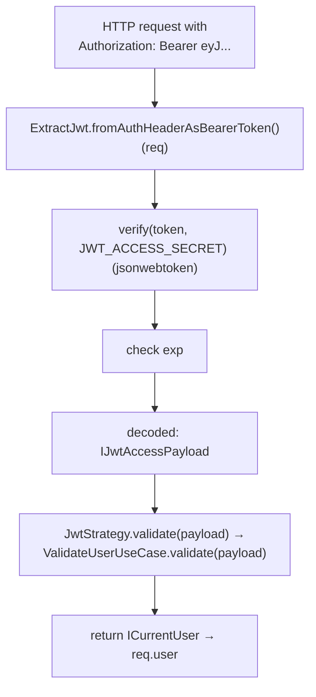

# Библиотека: `passport-jwt`

> [!abstract] Кратко
> `passport-jwt` — это `passport`-Strategy для **проверки**
> входящих JWT-токенов: извлекает токен из request'а (у нас
> — из `Authorization: Bearer`), проверяет подпись против
> `secretOrKey`, проверяет `exp`, декодирует payload и зовёт
> ваш `validate(payload, done)`-callback. Это **половина**
> JWT-стека: она про verify. Выпускает токены **другой**
> пакет — `@nestjs/jwt` ([[lib-nestjs-jwt]]). В проекте мы
> расширяем `passport-jwt.Strategy` через
> `PassportStrategy(Strategy, 'jwt')` mixin.

## Зачем оно нам

После того как клиент получил access-JWT на `/auth/login`,
он должен присылать его на каждый authenticated-запрос. Кто-
то должен:

1. достать токен из request'а;
2. удостовериться в подписи (это **именно мы** его выпустили,
   а не атакующий);
3. проверить, не истёк ли срок;
4. вернуть payload в виде объекта.

Можно было бы написать это руками — `jsonwebtoken.verify`
плюс свой Express-middleware. `passport-jwt` упаковывает
эти четыре шага в один passport-Strategy, который:

- унифицирован с любым другим passport-strategy (один
  paradigm для JWT, OAuth, local-auth);
- предлагает много готовых ExtractJwt-функций (header,
  query, cookie, body, custom);
- сериализован с `@nestjs/passport`-mixin'ом — наш
  `JwtStrategy` наследуется от него.

## Что этот пакет делает

### `ExtractJwt`-функции

`passport-jwt` экспортирует фабрики, возвращающие функцию
вида `(req) => string | null`. Самые частые:

- `ExtractJwt.fromAuthHeaderAsBearerToken()` — `Authorization: Bearer <token>`.
- `ExtractJwt.fromAuthHeaderWithScheme('JWT')` — `Authorization: JWT <token>` (нестандартно).
- `ExtractJwt.fromHeader('x-access-token')` — кастомный header.
- `ExtractJwt.fromUrlQueryParameter('token')` — `?token=…`.
- `ExtractJwt.fromBodyField('access_token')` — POST-body.
- `ExtractJwt.fromExtractors([…])` — fallback-композиция.

У нас — `fromAuthHeaderAsBearerToken()`, потому что
RFC 6750 — это и есть стандарт «как передавать JWT в
HTTP». Свой собственный header или query-параметр —
анти-паттерн для public-API.

### Конструктор `Strategy(options, verify)`

В сыром виде:

```typescript
import { Strategy as JwtStrategy, ExtractJwt } from 'passport-jwt';
import * as passport from 'passport';

passport.use(
  'jwt',
  new JwtStrategy(
    {
      jwtFromRequest: ExtractJwt.fromAuthHeaderAsBearerToken(),
      secretOrKey: 'access-secret',
      ignoreExpiration: false,
    },
    (payload, done) => {
      // 'payload' уже декодирован и верифицирован
      done(null, payload);
    },
  ),
);
```

Что важно понять: `verify`-callback (`(payload, done) => …`)
**вызывается уже после** того, как passport-jwt:

- извлёк токен;
- сверил подпись по `secretOrKey`;
- проверил `exp` (если `ignoreExpiration: false`).

То есть к моменту callback'а `payload` — это **доказанно
наш** JWT, не подделка и не expired. Дальше callback решает
бизнес-вопрос: «соответствует ли payload живому
пользователю?».

### Опции

- `jwtFromRequest` — функция извлечения (выше).
- `secretOrKey` — секрет (HS-256) или public key (RS-256).
- `secretOrKeyProvider` — динамический resolver (для
  rotating keys).
- `ignoreExpiration` — если `true`, не проверяет `exp`.
- `audience` / `issuer` — опциональные claims-сверки.
- `algorithms` — белый список разрешённых alg'ов
  (защита от alg-confusion-атак).

### Наш `JwtStrategy` поверх `passport-jwt`

```typescript
// libs/auth/jwt.strategy.ts
@Injectable()
export class JwtStrategy extends PassportStrategy(Strategy, 'jwt') {
  constructor(
    configService: ConfigService,
    @Inject(AUTH_USER_VALIDATOR) private readonly userValidator: IAuthUserValidator,
  ) {
    super({
      jwtFromRequest: ExtractJwt.fromAuthHeaderAsBearerToken(),
      ignoreExpiration: false,
      secretOrKey: configService.get<string>('JWT_ACCESS_SECRET')!,
    });
  }

  public async validate(payload: IJwtAccessPayload): Promise<ICurrentUser> {
    return this.userValidator.validate(payload);
  }
}
```

> [GitHub: libs/auth/jwt.strategy.ts](https://github.com/eugesher/retail-inventory-system/blob/84b1507c68fd9ee02b185eef3c4594b6fe02f664/libs/auth/jwt.strategy.ts#L10-L29)

Через `super({...})` в конструкторе мы передаём опции
**passport-jwt-Strategy**. Метод `validate(payload)` —
эквивалент `verify`-callback'а; mixin
`PassportStrategy` ([[lib-nestjs-passport]]) превратит
наш Promise-return в passport-`done(null, user)`.

Не указано `algorithms` — `passport-jwt` использует
`['HS256']` по умолчанию для `secretOrKey: string`, что
совпадает с нашим выбором (см. [[jwt-and-rbac]] §«HS256, два
секрета»). Если бы кто-то попытался передать JWT с
`alg: none` или `alg: RS256`, верификация бы упала.

### Поток на каждом authenticated-запросе



Этим занят `passport-jwt`. `JwtStrategy.validate` — наш код,
выполняется в самом конце.

## Что этот пакет НЕ делает

Очень короткий, но важный список:

- **Не выпускает JWT.** Подпись JWT при `/auth/login` —
  работа `@nestjs/jwt` (через нашу
  `JwtTokenAdapter.issueAccessToken()`). `passport-jwt`
  только **верифицирует**.
- **Не имеет понятия про refresh-токены.** Refresh — это
  наша бизнес-логика; `passport-jwt` верифицирует **любой**
  JWT, который ему дали (включая refresh, если бы мы
  передавали refresh-token в `Authorization: Bearer`). Но
  мы этого не делаем — refresh-JWT передаётся в POST-body
  на `/auth/refresh` и проверяется через `@nestjs/jwt`.
- **Не знает про БД.** В нашем `validate(payload)`-методе
  доступ к user-row'у идёт через `IAuthUserValidator`. Сам
  `passport-jwt` payload в БД не лезет.
- **Не управляет жизненным циклом ключей.** Если вы хотите
  ротировать ключи (типичный сценарий для RS256), это
  через `secretOrKeyProvider`-callback — но у нас один
  статичный `JWT_ACCESS_SECRET`.
- **Не делает RBAC.** Roles в payload — это просто
  обычное поле, `passport-jwt` не интерпретирует его.
  `RolesGuard` — отдельный пас.
- **Не короткоруб'ит на public-маршруты.** Этим занимается
  `JwtAuthGuard` через `@Public()` ([[lib-nestjs-passport]] /
  [[jwt-and-rbac]]).
- **Не работает на не-HTTP-транспортах.** RPC/RabbitMQ-
  context не поднимает Express-`req`, значит
  `ExtractJwt`-функции не имеют, откуда вытащить токен.

## Где используется в проекте

Импорт `passport-jwt` встречается **только** в
`libs/auth/jwt.strategy.ts` (одна строка). Это
характерно для wrapper-стиля: `@nestjs/passport` обрабатывает
весь passport-API, а `passport-jwt`-Strategy наследуется
ровно один раз.

Type-определения — `@types/passport-jwt@^4.0.1` (dev-dep), они
дают типы для `ExtractJwt.fromAuthHeaderAsBearerToken()` и
других экспортов.

Verify-секрет приходит из `JWT_ACCESS_SECRET` через
Joi-schema'у (`libs/config/config-module.config.ts`,
строка 25 —
[GitHub](https://github.com/eugesher/retail-inventory-system/blob/84b1507c68fd9ee02b185eef3c4594b6fe02f664/libs/config/config-module.config.ts#L25-L25)).

## Тривия: алгоритм по умолчанию

Конкретно `passport-jwt@4.x` подразумевает `algorithms:
['HS256']` для `secretOrKey: string`. Если бы мы передали
RS256-public-key как PEM-строку — пришлось бы явно
указать `algorithms: ['RS256']`, иначе verify сделался
бы под HS256 (что не валидно). OWASP-recommended практика —
**всегда** явно указывать `algorithms`, чтобы исключить
alg-confusion-атаки (атакующий ставит `alg: none` и
подделывает токен). У нас алгоритм — параметр secret'а, и
поскольку HS256 единственный — это допустимое упрощение,
но если завтра появится RS256-вариант, придётся явно
прописывать.

## Связанные решения

- [[auth-stack-overview]] — куда `passport-jwt` встаёт на
  диаграмме (между `passport` и `JwtStrategy.validate`).
- [[lib-passport]] — runner, который запускает
  `passport-jwt.Strategy`.
- [[lib-nestjs-passport]] — mixin, превращающий стратегию
  в `@Injectable()`.
- [[lib-nestjs-jwt]] — **выпускает** JWT, которые
  `passport-jwt` потом верифицирует. Симметричная пара.
- [[jwt-and-rbac]] — где `JwtStrategy.validate` решает
  «активен ли user».
- [[shared-libs-philosophy]] — почему `passport-jwt` живёт
  **только** в `libs/auth`.

## Глоссарий

| Термин (EN) | Перевод / пояснение (RU) |
|---|---|
| `passport-jwt` | NPM-пакет: passport-Strategy для проверки JWT. |
| `Strategy` (passport-jwt) | Класс, наследуемый нашим `JwtStrategy`. |
| `ExtractJwt` | Объект с фабриками функций извлечения токена. |
| `fromAuthHeaderAsBearerToken` | Извлекает из `Authorization: Bearer <token>`. |
| `secretOrKey` | Секрет (HS) или public-key (RS); используется для verify. |
| `secretOrKeyProvider` | Динамический resolver секрета — для ротации ключей. |
| `ignoreExpiration` | Если `true`, не проверяет `exp`. У нас — `false`. |
| `algorithms` | Whitelist разрешённых JWT-alg'ов; защита от alg-confusion. |
| Alg-confusion attack | Атака: ставят `alg: none`, подделывают JWT. |
| `verify`-callback | `(payload, done) => …` — для бизнес-проверок user'а. |
| JWT-claims | Поля `sub`, `iat`, `exp`, `aud`, `iss`, …. |
| RFC 6750 | Bearer Token Usage в HTTP. |

> [!faq]- Проверь себя
> 1. Какой пакет verify'ит подпись JWT — `passport-jwt` или
>    `@nestjs/jwt`? На каком HTTP-маршруте? А `verifyRefresh`
>    в `JwtTokenAdapter`?
> 2. Зачем явно указывать `algorithms` в опциях
>    `passport-jwt.Strategy`, даже если secret один?
> 3. Что будет, если в `super({ ignoreExpiration: true })`
>    передать `true` и забыть про refresh-flow? Опиши
>    риск.
> 4. Можно ли через `passport-jwt` принимать токен из cookie?
>    Какой `ExtractJwt`-функцией?

## Что почитать дальше

- [`passport-jwt` README](https://github.com/mikenicholson/passport-jwt#readme)
  — все `ExtractJwt`-фабрики и опции.
- [`jsonwebtoken`](https://github.com/auth0/node-jsonwebtoken#readme)
  — пакет, который `passport-jwt` использует под капотом
  для `verify`.
- [[lib-nestjs-jwt]] — кто и как выпускает JWT.
