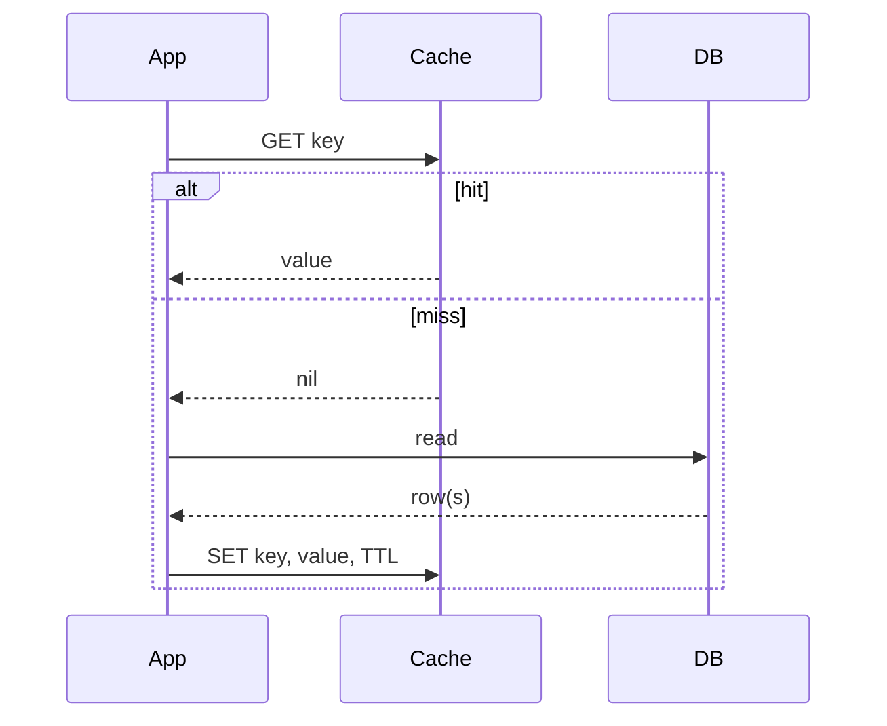
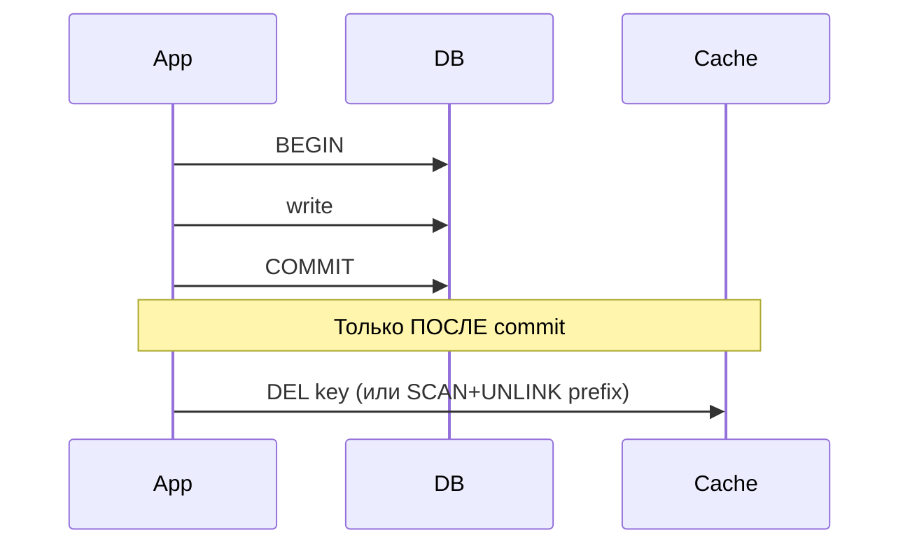

# Паттерн cache-aside

> [!abstract] Кратко
> Cache-aside (он же lazy loading) — паттерн кэширования, в котором
> **приложение само** решает, когда сходить в кэш и когда — в БД.
> Кэш не знает про БД; БД не знает про кэш; всё знание о том, как
> их связать, живёт в одном узком месте — порте `ICachePort` из
> `libs/cache` ([ADR-006](https://github.com/eugesher/retail-inventory-system/blob/84b1507c68fd9ee02b185eef3c4594b6fe02f664/docs/adr/006-cache-aside-via-libs-cache.md))
> и его потребителях вроде `StockCache`. В Retail Inventory System
> cache-aside закрывает дорогостоящий `SUM(quantity) GROUP BY storageId`
> по append-only-ledger'у `product_stock` ([ADR-002](https://github.com/eugesher/retail-inventory-system/blob/84b1507c68fd9ee02b185eef3c4594b6fe02f664/docs/adr/002-redis-cache-aside-product-stock.md)),
> с инвалидацией ключей по префиксу `ris:inventory:stock:<productId>:`
> через SCAN+UNLINK ([ADR-016](https://github.com/eugesher/retail-inventory-system/blob/84b1507c68fd9ee02b185eef3c4594b6fe02f664/docs/adr/016-cache-aside-generalized.md)),
> awaited **post-commit**. Аудит `audit-2026-05-08` остаётся
> частично открытым — `CACHE-001`, `CACHE-002`, `CACHE-003`,
> `CACHE-004`, `CACHE-005`, `CACHE-009` ещё в backlog'е.

## Проблема, которую решает

Когда HTTP-запрос приходит на gateway `GET /api/product/:id/stock`,
он превращается в RPC `inventory.product-stock.get` → inventory →
TypeORM-запрос вида:

```sql
SELECT storage_id, SUM(quantity) AS total
FROM product_stock
WHERE product_id = ?
GROUP BY storage_id;
```

`product_stock` — это **ledger**: каждая резервация или
restock пишет новую строку с дельтой `quantity` (положительная
или отрицательная) — старые строки не апдейтятся. Это значит:
чем больше резерваций по продукту, тем больше строк в
`SUM ... GROUP BY`, тем дольше DB-агрегация. На фоне типичной
read-heavy / write-light нагрузки (cтоки читаются на каждый
order-flow, иногда несколько раз) это превращается в:

- **высокую DB-latency** на чтении одних и тех же продуктов;
- **квадратичную деградацию** при росте ledger'а;
- **бесполезные дубли работы** — соседние запросы по одному
  product`у дают тот же результат, но БД пересчитывает каждый.

Самое прямое решение — поставить кэш **между read-handler'ом и
БД**. Но кэш надо как-то синхронизировать с записями: на
момент резервации стока (`ReserveStockForOrderUseCase`) кэш
становится stale через миллисекунду, и если следующий
GET вернёт старое значение — система может **overshell**
(подтвердить заказ на единицу, которой уже нет в наличии).

Cache-aside даёт явное, простое правило: **приложение знает обо
всём** — оно ходит в кэш, оно ходит в БД, оно инвалидирует кэш
после write'а. БД и кэш — две независимые системы, между ними
нет неявных мостов.

## Концепция

### Cache-aside от первых принципов

В чистом виде паттерн выглядит как два потока — read и
invalidate, плюс невидимая третья ветка «expire by TTL».

**Read path:**



Из паттерна следуют четыре ключевых свойства:

- **Lazy-loading.** Кэш заполняется не «при записи», а
  «при первом промахе на чтении». Если данные не читают —
  они не попадают в кэш. Это экономия памяти на «холодных»
  ключах.
- **TTL обязателен.** Если кто-то изменит DB-строку, минуя
  путь app'а (миграция, чёрный SQL admin), TTL — единственный
  гарант eventual consistency.
- **Граф зависимостей плоский.** Кэш не знает про БД;
  БД не знает про кэш; знание о «положи в кэш то, что
  только что прочитал» — внутри app'а.
- **Кэш может упасть, и это OK.** Cache.get кидает — читаем БД,
  отдаём ответ. Cache.set кидает — отдаём ответ, в кэш не
  заносим. Эта graceful degradation — обязательная часть
  паттерна, а не bonus.

**Invalidate path:**



Здесь критично слово **«после»**. Если инвалидировать **до**
commit'а, между `DEL` и `COMMIT` соседний reader попадает в miss,
читает из БД старое значение, пишет его в кэш — и после нашего
commit'а в кэше живёт устаревшее значение. См. ADR-002 §«Read
path» и ADR-016 §3 — оба явно требуют post-commit invalidate.

### Чем cache-aside отличается от соседних паттернов

| Паттерн | Кто решает, когда писать в кэш? | Кто решает, когда читать из БД? | Кто инвалидирует? |
|---|---|---|---|
| **Cache-aside** | App после miss'а | App на miss'е | App после write'а |
| **Read-through** | Кэш сам (по своему API) | Кэш сам в случае miss'а | App (или TTL) |
| **Write-through** | App пишет одновременно в БД и в кэш | App | Подразумевается синхронной записью |
| **Write-behind** | App пишет в кэш, кэш асинхронно flush'ит в БД | App | — |

Read-through часто видят как «более удобный» вариант
cache-aside — фасад делает `cache.wrap(key, ttl, loader)` и
не показывает app'у hit/miss. Мы такой фасад тоже выставляем:
`ICachePort.wrap(...)` (см. [[lib-cache-manager]] и
[[lib-cacheable]]); но это **syntactic sugar поверх
cache-aside**, не отдельная политика — лишь сворачивание трёх
шагов в один вызов.

Write-through для нашего случая не работает: `product_stock`
— ledger, каждая запись это **дельта**, а кэшируется
**aggregation**. Чтобы синхронно обновить кэш, надо знать
полную новую агрегацию, что эквивалентно прочесть БД
заново — никакого выигрыша. ADR-002 §«Alternatives» это
формализует.

Write-behind не подходит по двум причинам: append-only ledger
плохо терпит асинхронный flush (порядок!), и потеря записи в
случае падения redis'а в нашей системе — критично.

### Antipattern: invalidate-внутри-транзакции

Самая частая ловушка. Кажется, что:

```typescript
await em.transaction(async (tx) => {
  await write(tx);
  await cache.invalidate(key);
});
```

симметрично и хорошо. На деле:

1. T1: invalidate бьёт DEL, кэш пустой.
2. T2 (concurrent reader): cache miss, читает БД.
3. T1: ещё не commit'нул — T2 видит **до-write'овое** состояние.
4. T2 пишет старое значение в кэш под тот же ключ.
5. T1: commit. В БД — новое; в кэше — старое.

Этот сценарий в ADR-002 явно отмечен и в ADR-016 §3
закреплён как post-commit-only contract. Аудит ставит
`CACHE-002` за то, что сегодня contract enforced только
комментарием — see «Аудит» ниже.

### Antipattern: write-through там, где кэш не равен БД-строке

Описано выше в таблице. Конкретно у нас попытка сделать
`product_stock`-write-through привела бы к тому, что после
каждой резервации мы делаем `cache.set(key, ...)` с уже
другим payload'ом (`SUM(quantity)`) — и должны его пересчитать,
снова читая ledger. Это **миф полезности write-through** для
кэшей с derived-shape.

## Применение в проекте

### Канонический read-flow: `GetStockUseCase`

Use-case инжектит `IStockCachePort` (не `CACHE_PORT` напрямую —
обёртка `StockCache` знает про key-shape), а не TypeORM-сначала:

```typescript
// apps/inventory-microservice/src/modules/stock/application/use-cases/get-stock.use-case.ts
const cached = await this.stockCache.get({ productId, storageIds, correlationId });

// Strict undefined check matches the cache adapter's miss/error contract:
// both miss and read-error return undefined. Avoid coupling to the
// invariant that response DTOs are always non-null objects.
if (cached !== undefined) {
  return cached;
}

// Cache-aside read/write race window — between this miss and the
// cache.set below, a concurrent writer could commit + SCAN-invalidate,
// then we'd write the now-stale DB result back to the cache. No
// single-flight / version stamp here today; tracked for a future pass.
// AUDIT-2026-05-08 [CACHE-001]
const data = await this.repository.aggregateForProduct({
  productId,
  storageIds,
  correlationId,
});

await this.stockCache.set({ productId, storageIds, data, correlationId });

return data;
```

> [GitHub: apps/inventory-microservice/src/modules/stock/application/use-cases/get-stock.use-case.ts](https://github.com/eugesher/retail-inventory-system/blob/84b1507c68fd9ee02b185eef3c4594b6fe02f664/apps/inventory-microservice/src/modules/stock/application/use-cases/get-stock.use-case.ts#L54-L76)

Этот фрагмент — **классическая cache-aside read path** в десяти
строках:

1. `await stockCache.get(...)` — пытаемся прочитать.
2. Hit (`cached !== undefined`) — возвращаем сразу.
3. Miss — читаем из БД через repository.
4. `await stockCache.set(...)` — кладём в кэш под TTL
   (`CACHE_TTL_MS_PRODUCT_STOCK`, default 60 000 ms).

Skip-cache-ветка (если caller передал свой `entityManager` или
`ignoreCache: true`) — отдельная ветка чуть выше: чтение
внутри транзакции caller'а может видеть pre-commit-данные;
кэшировать их нельзя, иначе мы заразим разделяемый Redis
неподтверждённым snapshot'ом.

### Канонический invalidate: `ReserveStockForOrderUseCase`

Write-сторона устроена ровно по правилу «**post-commit and
awaited**»:

```typescript
// apps/inventory-microservice/src/modules/stock/application/use-cases/reserve-stock-for-order.use-case.ts
await this.entityManager.transaction(async (entityManager) => {
  // ... read-lock + appendDeltas внутри транзакции
});

// Post-commit: invalidate cached stock for every (productId, storageId)
// pair we just mutated. Must run after the transaction commits — calling
// invalidate inside the callback would race with concurrent readers that
// could re-populate the cache from uncommitted state.
//
// Awaited rather than fire-and-forget. Per ADR-016, the confirm RPC's
// post-state must include "cache invalidated for the mutated products"
// so the very next GET reads the fresh DB row. The SCAN+UNLINK cost is
// a few ms; the adapter swallows backend errors so this never raises.
// CACHE-001's read/write race window remains open and is tracked.
if (items.length > 0) {
  // ...
  await this.stockCache.invalidate({ items: invalidateItems, correlationId });
  // ...
}
```

> [GitHub: apps/inventory-microservice/src/modules/stock/application/use-cases/reserve-stock-for-order.use-case.ts](https://github.com/eugesher/retail-inventory-system/blob/84b1507c68fd9ee02b185eef3c4594b6fe02f664/apps/inventory-microservice/src/modules/stock/application/use-cases/reserve-stock-for-order.use-case.ts#L114-L156)

Здесь видны три важные детали:

1. **`await this.entityManager.transaction(...)`** уже закончился к
   моменту invalidate'а. Никаких uncommitted-rows.
2. **`await this.stockCache.invalidate(...)`** — не
   fire-and-forget. До ADR-016 это был `void this.stockCache.invalidate(...)`
   ради latency'а; ADR-016 пересмотрел trade-off: лишние
   несколько мс на post-commit-await ценнее, чем
   detectable test-flake на «после confirm'а GET ещё видит старый
   stock». См. ADR-016 §3.
3. **Try/catch внутри `StockCache.invalidate`** проглатывает
   ошибки SCAN/UNLINK — invalidate никогда не валит confirm.
   Redis-down → cache stale до TTL.

### `StockCache` как domain-shaped обёртка над `ICachePort`

Use-case никогда не знает строки `'ris:inventory:stock:42:__all__'`.
Внутри модуля `stock/` живёт небольшая обёртка над общим
портом — `StockCache`:

```typescript
// apps/inventory-microservice/src/modules/stock/infrastructure/cache/stock.cache.ts
@Injectable()
export class StockCache implements IStockCachePort {
  constructor(
    @Inject(CACHE_PORT)
    private readonly cache: ICachePort,
    private readonly configService: ConfigService,
    @InjectPinoLogger(StockCache.name)
    private readonly logger: PinoLogger,
  ) {}

  public async get(
    payload: IStockCacheGetPayload,
  ): Promise<ProductStockGetResponseDto | undefined> {
    const { productId, storageIds, correlationId } = payload;
    const cacheKey = CACHE_KEYS.inventoryStock(productId, storageIds);

    try {
      const cached = await this.cache.get<ProductStockGetResponseDto>(cacheKey);
      // ...
      return cached;
    } catch (error) {
      this.logger.warn(...);
      return undefined;
    }
  }
  // ...
  public async invalidate(payload: IStockCacheInvalidatePayload): Promise<void> {
    const productIds = [...new Set(items.map((i) => i.productId))];
    // Two prefixes are wiped per productId:
    //   * `ris:inventory:stock:<productId>:` — the post-ADR-016 shape
    //   * `stock:<productId>:`               — the pre-ADR-016 legacy shape,
    //                                          covered for one rolling deploy.
    const counts = await Promise.all(
      productIds.flatMap((productId) => [
        this.cache.delByPrefix(CACHE_KEYS.inventoryStockPrefix(productId)),
        this.cache.delByPrefix(CACHE_KEYS.productStockPrefix(productId)),
      ]),
    );
    // ...
  }
}
```

> [GitHub: apps/inventory-microservice/src/modules/stock/infrastructure/cache/stock.cache.ts](https://github.com/eugesher/retail-inventory-system/blob/84b1507c68fd9ee02b185eef3c4594b6fe02f664/apps/inventory-microservice/src/modules/stock/infrastructure/cache/stock.cache.ts#L27-L125)

Что здесь интересно:

- **Domain shape ↔ generic port.** `IStockCachePort` принимает
  `IStockCacheGetPayload` (`{ productId, storageIds, correlationId }`),
  не строку. Use-case говорит на языке домена. `CACHE_KEYS.inventoryStock(...)`
  — единственное место, где «продукт 42 без фильтров»
  превращается в `ris:inventory:stock:42:__all__`.
- **`delByPrefix` дважды.** Один вызов для нового префикса,
  один для legacy `stock:`. Это «one-deploy transition window»
  из ADR-016 §3 — пока в Redis ещё могут лежать ключи,
  записанные до выкатки.
- **Try/catch + warn.** Графsейф деградация. Если Redis лёг,
  логируем `'Failed to invalidate stock cache'` и возвращаемся;
  flow confirm'а отрабатывает целиком, кэш позже expire'нется
  через TTL.

Подробно про DI-связку port↔adapter и DI-символ `STOCK_CACHE`
см. [[mappers-and-repositories]] §«DI-binding в module» — та же
техника, что и с TypeORM-репозиториями.

### `CACHE_KEYS` — единственный источник истинных ключей

В `apps/*/src` **запрещены** строковые литералы под cache-key.
Любой ключ строится через builder в `libs/cache/cache-keys.ts`:

```typescript
// libs/cache/cache-keys.ts
export const CACHE_KEYS = {
  inventoryStockPrefix: (productId: number): string => `ris:inventory:stock:${productId}:`,

  inventoryStock: (productId: number, storageIds?: string[]): string => {
    const prefix = CACHE_KEYS.inventoryStockPrefix(productId);
    const facet =
      storageIds && storageIds.length > 0
        ? [...storageIds].sort((a, b) => a.localeCompare(b)).join(',')
        : '__all__';
    return `${prefix}${facet}`;
  },

  retailOrderPrefix: (orderId: number): string => `ris:retail:order:${orderId}`,
  retailOrder: (orderId: number): string => CACHE_KEYS.retailOrderPrefix(orderId),

  // -- Legacy convention ----------------------------------------------------
  // Retained so the SCAN-based invalidate path can wipe entries written
  // under the previous prefix during a single rolling deploy.
  productStockPrefix: (productId: number): string => `stock:${productId}:`,
  // ...
} as const;
```

> [GitHub: libs/cache/cache-keys.ts](https://github.com/eugesher/retail-inventory-system/blob/84b1507c68fd9ee02b185eef3c4594b6fe02f664/libs/cache/cache-keys.ts#L26-L56)

Соглашение: **`ris:<service>:<aggregate>:<id>[:<facet>]`**.

- `ris:` — namespace проекта. Redis может быть shared с
  соседними системами.
- `<service>`/`<aggregate>` — qualifier, исключающий
  cross-aggregate-коллизии.
- `<id>` — идентификатор агрегата.
- `[:<facet>]` — фасет (например, `__all__` или
  `head-warehouse,west-warehouse`).

Два audit'а закрыты этим builder'ом:

- **`CACHE-010`** — sort через `localeCompare`. Старый
  comparator сравнивал `charCodeAt(0)` и mis-sort'ил длинные
  строки.
- **`CACHE-011`** — sentinel `__all__` (не glob). Старый
  literal `*` мог наложиться на SCAN pattern и удалять
  лишние ключи.

### Аудит: что закрыто, что открыто

К моменту task-06 в проекте 12 `CACHE-*`-findings из
[`audit-2026-05-08`](https://github.com/eugesher/retail-inventory-system/blob/84b1507c68fd9ee02b185eef3c4594b6fe02f664/docs/audits/audit-2026-05-08.md).

**Закрыто** (ADR-016 / task-11):

- `CACHE-006` — reach-through через `Cache → cacheable.primary →
  store → KeyvRedis` теперь живёт **в одной библиотечной
  точке** (`libs/cache/redis-cache.adapter.ts`). Подробнее —
  [[lib-cacheable]].
- `CACHE-010` — sort `localeCompare`.
- `CACHE-011` — sentinel `__all__`.
- `CACHE-012` — combo-key fallback больше не нужен (non-Redis
  ветка `delByPrefix` — задокументированный no-op).

**Открыто** (упоминается в коде через `// AUDIT-2026-05-08 [CACHE-N]`):

- **`CACHE-001` — read/write race**. Между `cache.miss` и
  `cache.set` соседний writer может commit'нуть; мы напишем
  stale-значение в кэш. Сейчас bounded by TTL. Fix — single-flight
  / version-stamp.
- **`CACHE-002` — post-commit contract enforced только комментарием**.
  Type-system не запрещает вызвать `invalidate()` внутри
  транзакции. Fix — `afterCommit` callback registry или
  transaction-aware-helper.
- **`CACHE-003` — нет schema-version-сегмента**. Breaking
  change в `ProductStockGetResponseDto` оставит stale-entries
  на TTL-окно. Fix — `ris:inventory:stock:v2:<productId>:...`.
- **`CACHE-004` — TTL без jitter'а**. Thundering herd на
  TTL-границе если трафик скоррелирован. Fix — ±10% jitter
  при `set`.
- **`CACHE-005` — двойные warn'ы на Redis-down**. `cache.get`
  throw → warn, потом `cache.set` тоже throw → warn. Net
  behavior корректный, но шумный. Fix — `cacheAvailable`-флаг.
- **`CACHE-007` / `CACHE-008` — missing unit coverage** для
  skip-cache и transaction-failure-пути. Доменный, не
  архитектурный backlog.
- **`CACHE-009` — нет tenant-сегмента**. Multi-tenant model'а
  пока нет.

Открытые items видны в коде:

- `get-stock.use-case.ts:67` — `// AUDIT-2026-05-08 [CACHE-001]`
- `stock.cache.ts:20-25` — комментарий-список `CACHE-001`,
  `CACHE-003`, `CACHE-004`, `CACHE-005`, `CACHE-006` (последний
  закрыт, оставлен для контекста).

Когда reader идёт в код и натыкается на эти маркеры — он
должен знать, что они **не TODO**, а живой backlog, привязанный
к одному артефакту аудита.

### Связь с messaging: invalidate awaited, событие — fire-and-forget

В `ReserveStockForOrderUseCase` соседствуют два «post-commit
side-effect'а»:

- **`await stockCache.invalidate(...)`** — мы блокируем reply на
  cache invalidation. Без неё post-state RPC некорректен.
- **`publisher.publishStockLow(...)`** — мы **не** ждём ответа
  notification'а; ошибка warn-логируется. Подробнее семантика
  событий — [[message-vs-event-patterns]] §«Event». Кэш —
  часть consistency-границы; нотификация — best-effort.

Эта асимметрия — деталь, которую легко упустить. Она
работает потому, что **кэш разделяется между двумя
репликами** одного инвентори-сервиса, и stale-state кэша
напрямую влияет на корректность последующих RPC; событие
notification — про user-experience, не про consistency.

## Связанные решения

- [[cache-stack-overview]] — какая библиотека за какой
  лежит «под» этим паттерном (Nest CacheModule → cache-manager
  → keyv → @keyv/redis → Redis).
- [[lib-cacheable]] — multi-tier-обёртка, через которую
  адаптер дотягивается до Redis-клиента для SCAN+UNLINK.
- [[hexagonal-architecture]] — почему `ICachePort` — в
  application/, а `RedisCacheAdapter` — в infrastructure/.
- [[shared-libs-philosophy]] — почему `libs/cache` — отдельная
  bounded library, а не часть `libs/common`.
- [[message-vs-event-patterns]] — post-commit cache.invalidate
  awaited vs publishStockLow fire-and-forget — два разных
  стиля «после commit'а».
- [[mappers-and-repositories]] — DI-связка `{ provide: STOCK_CACHE,
  useExisting: StockCache }` устроена так же, как для
  repository-port'а.

## Глоссарий

| Термин (EN) | Перевод / пояснение (RU) |
|---|---|
| Cache-aside | Паттерн «app сам читает кэш и сам инвалидирует». Синоним: lazy loading. |
| Read-through | Кэш сам читает БД на miss'е (фасадная обёртка над cache-aside в одном API-вызове). |
| Write-through | Каждый write идёт в БД и в кэш синхронно. Не наш случай. |
| Write-behind | Write в кэш, асинхронный flush в БД. Не наш случай. |
| TTL | Time-to-live, время жизни ключа. Default — `CACHE_TTL_MS_DEFAULT` (60000ms). |
| Ledger | Append-only таблица со знаковыми дельтами. `product_stock` — ledger. |
| SCAN | Команда Redis для итерации ключей по pattern'у, не блокирует. |
| UNLINK | Удаление ключей Redis с async-free памяти в background-thread. |
| `delByPrefix` | Метод `ICachePort`. SCAN+UNLINK под капотом. Returns N unlinked. |
| `CACHE_PORT` | DI-токен (Symbol) для `ICachePort` из `libs/cache`. |
| `CACHE_KEYS` | Frozen `as const`-объект builder'ов ключей. Только он строит литералы. |
| `__all__` | Sentinel в `inventoryStock`-ключе, означающий «все storages» (не glob `*`). |
| Graceful degradation | Стиль обработки ошибок: кэш-fail логируется и проглатывается, поведение fallback'а — DB. |
| Post-commit | Действие, выполняющееся **после** успешного `COMMIT` транзакции. |
| Single-flight | Защита от stampede: один из конкурентных miss'ов делает DB-запрос, остальные ждут его. |
| Schema-version segment | Сегмент ключа `:v2:`, инвалидирующий старые entries при breaking shape-change. |
| Stampede / Thundering herd | Множество одновременных miss'ов на одном ключе → пиковая нагрузка на БД. |

> [!faq]- Проверь себя
> 1. Почему cache-aside, а не write-through для агрегированного
>    `product_stock`?
> 2. Что произойдёт, если в `ReserveStockForOrderUseCase`
>    переместить `await stockCache.invalidate(...)` внутрь
>    `em.transaction(async (em) => { ... })`?
> 3. Зачем `StockCache.invalidate` дёргает `delByPrefix`
>    дважды (новый префикс + legacy)?
> 4. Где живёт компилируемая гарантия, что app не запишет
>    cache-key литералом?
> 5. Какие из 12 `CACHE-*`-аудит-finding'ов закрыты ADR-016, а
>    какие ещё открыты?

## Что почитать дальше

- [AWS — Caching strategies](https://aws.amazon.com/caching/best-practices/)
  — короткая таблица cache-aside vs write-through vs write-behind.
- [Redis docs — SCAN](https://redis.io/commands/scan/) — почему
  SCAN, а не KEYS, и как `COUNT` влияет на latency.
- [Redis docs — UNLINK](https://redis.io/commands/unlink/) —
  чем UNLINK лучше DEL на больших ключах.
- [«Caching at Scale With Redis», DesignGurus](https://www.designgurus.io/blog/caching-at-scale-redis)
  — обзор production-практик: TTL jitter, schema-version,
  single-flight.
