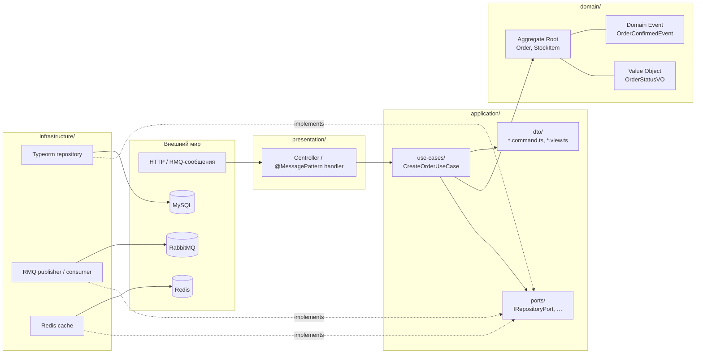

# Слои Clean Architecture в per-module hexagonal layout

> [!abstract] Кратко
> Внутри каждого модуля Retail Inventory System код разложен по четырём
> папкам — `domain/`, `application/`, `infrastructure/`, `presentation/`.
> Это адаптация Clean Architecture Роберта Мартина под Nest-монорепо:
> направление зависимости всегда **внутрь** (`presentation` →
> `application` → `domain`; `infrastructure` зависит от
> `domain`/`application` только через интерфейсы-порты). См. ADR-004 §
> «Per-module layout» и [`recommendation.md` Section 3](https://github.com/eugesher/retail-inventory-system/blob/84b1507c68fd9ee02b185eef3c4594b6fe02f664/docs/architecture-migration-plan/parts/recommendation.md).

## Проблема, которую решает

Слоистая архитектура «по типу файла» (`controllers/`, `services/`,
`repositories/`, `entities/`) — естественный первый шаг, но она ничего
не говорит про **направление зависимости**. Контроллер импортирует
сервис, сервис — репозиторий, репозиторий — entity; цепочка идёт
сверху вниз и кажется чистой, пока в сервис не приходит зависимость от
HTTP-уровня (`Response` объекта Express), а entity не начинает
описывать поля DTO для swagger'а.

Clean Architecture (Robert C. Martin, 2012; книга — 2017) даёт жёсткое
правило: **исходящий код зависит только от внутренних слоёв**. Слой
`domain/` — самое внутреннее кольцо; он ничего не знает ни про
NestJS, ни про базу, ни про HTTP. Слой `application/` — следующее
кольцо; он знает domain, но не знает ни про какую конкретную
инфраструктуру. И только адаптеры на периферии знают всё.

В нашем проекте это правило реализовано **внутри каждого модуля**:
четыре папки, чёткие правила импортов, и `eslint-plugin-boundaries`
ловит нарушения на CI.

## Концепция

### Четыре слоя и направление зависимости



Сплошные стрелки — обычные импорты. Пунктирные — `implements`. Все
стрелки идут **внутрь**: ни одна не направлена из `domain/` наружу.

### Что лежит в каждом слое

- **`domain/`** — aggregates, entities, value objects, domain events,
  domain services. Никаких импортов фреймворка. Допустимы:
  `@retail-inventory-system/ddd` (`AggregateRoot`, `Entity`,
  `ValueObject`, `DomainEvent`), `@retail-inventory-system/contracts`
  (enum'ы и interface-типы), `@retail-inventory-system/common`
  (`Result`, `DomainException`). См. `eslint.config.mjs:113-117`.
- **`application/use-cases/`** — оркестраторы. Каждый use-case — один
  класс, одна публичная операция (`execute(payload)`), инжектит
  только порты и `PinoLogger`. Возвращает либо domain-объект, либо
  view-DTO.
- **`application/ports/`** — TypeScript-интерфейсы + DI-символы
  (`ORDER_REPOSITORY`, `STOCK_CACHE`, `NOTIFIER`). Не зависят ни от
  чего, кроме domain-типов и `lib-ddd` / `lib-contracts`. См.
  `eslint.config.mjs:319-342` — это самый узкий «горизонт импорта» из
  всех слоёв.
- **`application/dto/`** — `*.command.ts`, `*.query.ts`, `*.view.ts`
  — структуры данных, которыми обмениваются presentation и use-case.
  Они **не** обязаны совпадать с wire-format DTO в
  `@retail-inventory-system/contracts`; направление и форма
  определяются нуждой модуля. См. [[dto-by-direction]].
- **`infrastructure/`** — адаптеры: TypeORM-репозитории, RMQ-
  publisher'ы и consumer'ы, Redis-кэш, HTTP-клиенты. Здесь и только
  здесь живут импорты `typeorm`, `@nestjs/microservices`,
  `@keyv/redis`, `nestjs-pino`. Также здесь — Nest-модуль
  `<module>.module.ts`, связывающий DI-символы с провайдерами.
- **`presentation/`** — HTTP-контроллеры (`OrderController`),
  RPC-handler'ы (`@MessagePattern`), pipes (`OrderCreatePipe`,
  `OrderConfirmPipe`). Тонкая прослойка: контроллер вызывает
  use-case, pipe конвертирует payload в domain-форму. Никакой бизнес-
  логики.

### Правило зависимости

Если коротко — **внутренний слой ничего не знает о внешнем**. На
практике в нашем коде это сводится к четырём предложениям:

1. `domain/` ничего никуда не импортирует, кроме того же `domain/`,
   `lib-ddd`, `lib-common`, `lib-contracts`.
2. `application/use-cases/` импортирует `domain/`, `application/ports/`,
   `application/dto/`, `lib-ddd`, `lib-common`, `lib-contracts`,
   `lib-auth`.
3. `presentation/` импортирует `application/*`, `presentation/`,
   `lib-contracts`, `lib-auth`, `lib-messaging`, `lib-observability` —
   и **ни одного** TypeORM/Redis/RMQ-клиента напрямую.
4. `infrastructure/` импортирует всё, что хочет, потому что это
   единственное место, где живут конкретные клиенты внешних систем.

Эти правила — не «договорённость», а исполняемое правило ESLint;
подробнее — в [[module-boundaries]].

### Поток на одном вызове

Чтобы увидеть слои в действии, проследим путь HTTP-запроса
`POST /api/order`:

1. **Presentation (gateway)** — `OrderController.create`
   принимает body, прогоняет через `OrderCreateRequestDto` с
   `class-validator`, вызывает `createOrderUseCase.execute({...})`.
2. **Application (gateway)** — `CreateOrderUseCase` в gateway
   получает payload, добавляет `correlationId` из заголовка и
   вызывает `RETAIL_GATEWAY_PORT.createOrder(...)`. Это
   driving-/driven-стык между HTTP-слоем и шиной.
3. **Infrastructure (gateway)** — `RetailRabbitmqAdapter` (adapter
   на gateway) шлёт `retail.order.create` через `ClientProxy`,
   ждёт ответа через `firstValueFrom`.
4. **Presentation (retail)** — `OrderController.create` в retail-
   микросервисе срабатывает на `@MessagePattern(ROUTING_KEYS.RETAIL_ORDER_CREATE)`,
   payload прогоняется через `OrderCreatePipe` (которая зовёт
   `IOrderRepositoryPort.customerExists` и `findExistingProductIds`
   для предварительной валидации).
5. **Application (retail)** — `CreateOrderUseCase.execute(payload)`
   создаёт `Order.create({ customer, lines })`, вызывает
   `repository.save(order)`, затем `publisher.publishOrderCreated(...)`.
6. **Domain (retail)** — `Order.create` проверяет инварианты и
   возвращает aggregate-root. `OrderCreatedEvent` сейчас
   конструируется в use-case'е (поскольку id заказа выдаётся только
   после persist).
7. **Infrastructure (retail)** — `OrderTypeormRepository.save`
   маппит aggregate в TypeORM-entity и записывает в MySQL.
   `OrderRabbitmqPublisher.publishOrderCreated` шлёт событие в RMQ.
8. **Presentation (notification)** — `OrderEventsConsumer` слушает
   `retail.order.created` через `@EventPattern`, передаёт в
   use-case.

Шесть пересечений слоёв, ни одного нарушения правила
зависимости. **Важно**: на каждом «выходе» из application наружу
стоит порт, а на каждом «входе» снаружи в application — controller
или pipe.

### Где живут DTO

DTO — это лакмусовая бумажка слоёв:

- `apps/*/src/.../application/dto/*.command.ts` — что **внутрь**
  получает use-case;
- `apps/*/src/.../application/dto/*.view.ts` — что **наружу** отдаёт
  use-case;
- `apps/*/src/.../presentation/dto/*.request.dto.ts` — wire-format
  HTTP/RPC от клиента;
- `apps/*/src/.../presentation/dto/*.response.dto.ts` — wire-format в
  ответ;
- `libs/contracts/<service>/dto/*` — cross-service-контракты, общие
  для двух и более сервисов.

Подробнее в [[dto-by-direction]].

### Что слои **не** делают

- **`domain/` не делает I/O.** Никаких `await`, никаких `fetch`, ни
  одного логирования в файл. Чистая логика и память.
- **`application/` не выбирает технологию.** Use-case не знает, что
  данные летят в MySQL — он знает только, что есть
  `IOrderRepositoryPort.save`.
- **`presentation/` не считает бизнес-правила.** Если кажется, что
  pipe «знает», что заказ нельзя создать без позиций, — это значит,
  что инвариант продублирован в `Order.create`. Pipe должен лишь
  обнаружить отсутствие customer'а в БД (это «технический» вопрос
  существования, а не бизнес-правило).
- **`infrastructure/` не возвращает entity наружу.** Адаптер всегда
  возвращает domain-объект — переводит туда и обратно через маппер.
  Иначе TypeORM-форма «протекает» в use-case.

## Применение в проекте

Все четыре модульных слоя видны на дисках в каждом модуле. Возьмём
`apps/retail-microservice/src/modules/orders/`:

```
modules/orders/
├── domain/
│   ├── customer.model.ts                  # CustomerRef VO
│   ├── order.model.ts                     # Order aggregate root
│   ├── order-product.model.ts             # OrderProduct child entity
│   ├── order-status.value-object.ts       # OrderStatusVO
│   ├── order-product-status.value-object.ts
│   ├── events/
│   │   ├── order-created.event.ts
│   │   ├── order-confirmed.event.ts
│   │   └── order-cancelled.event.ts
│   └── index.ts                           # барель: только domain-экспорты
├── application/
│   ├── ports/
│   │   ├── order.repository.port.ts       # IOrderRepositoryPort + ORDER_REPOSITORY
│   │   ├── order-events.publisher.port.ts # IOrderEventsPublisherPort + ORDER_EVENTS_PUBLISHER
│   │   ├── inventory-confirm.gateway.port.ts
│   │   └── index.ts
│   └── use-cases/
│       ├── create-order.use-case.ts
│       ├── confirm-order.use-case.ts
│       ├── get-order.use-case.ts
│       └── index.ts
├── infrastructure/
│   ├── persistence/
│   │   ├── order.entity.ts                # @Entity TypeORM
│   │   ├── order.mapper.ts                # entity ↔ domain
│   │   ├── order-typeorm.repository.ts    # IOrderRepositoryPort impl
│   │   └── ...
│   ├── messaging/
│   │   ├── order-rabbitmq.publisher.ts
│   │   └── inventory-confirm-rabbitmq.adapter.ts
│   └── orders.module.ts                   # связывает DI-символы с провайдерами
└── presentation/
    ├── orders.controller.ts               # @MessagePattern handlers
    └── pipes/
        ├── order-create.pipe.ts
        └── order-confirm.pipe.ts
```

Тот же скелет — у `apps/inventory-microservice/src/modules/stock/` и у
`apps/notification-microservice/src/modules/notifications/`. На уровне
gateway модули `retail/` и `inventory/` — pass-through (без `domain/`),
а `auth/` — единственный gateway-модуль с настоящим domain'ом (User
aggregate).

### Цитата controller'а: какой импорт-горизонт у presentation

```typescript
// apps/retail-microservice/src/modules/orders/presentation/orders.controller.ts
import { Controller } from '@nestjs/common';
import { MessagePattern, Payload } from '@nestjs/microservices';

import {
  IOrderConfirm,
  IOrderCreatePayload,
  OrderConfirmResponseDto,
  OrderCreateResponseDto,
  OrderStatusEnum,
} from '@retail-inventory-system/contracts';
import { ROUTING_KEYS } from '@retail-inventory-system/messaging';

import { ConfirmOrderUseCase, CreateOrderUseCase, GetOrderUseCase } from '../application/use-cases';
import { OrderConfirmPipe, OrderCreatePipe } from './pipes';

@Controller()
export class OrderController {
  constructor(
    private readonly createOrderUseCase: CreateOrderUseCase,
    private readonly confirmOrderUseCase: ConfirmOrderUseCase,
    private readonly getOrderUseCase: GetOrderUseCase,
  ) {}
  // ...
}
```

> [GitHub: apps/retail-microservice/src/modules/orders/presentation/orders.controller.ts](https://github.com/eugesher/retail-inventory-system/blob/84b1507c68fd9ee02b185eef3c4594b6fe02f664/apps/retail-microservice/src/modules/orders/presentation/orders.controller.ts#L1-L42)

Импорты у контроллера: `@nestjs/common`, `@nestjs/microservices`,
`lib-contracts`, `lib-messaging`, use-cases этого же модуля,
pipes этого же модуля. И **ничего** про TypeORM, Redis, или RMQ-клиент.
Линт это и фиксирует — см. `eslint.config.mjs:355-369`.

### Цитата use-case'а: какой импорт-горизонт у application

```typescript
// apps/retail-microservice/src/modules/orders/application/use-cases/create-order.use-case.ts
import { Inject, Injectable } from '@nestjs/common';
import { InjectPinoLogger, PinoLogger } from 'nestjs-pino';

import {
  IOrderCreatePayload,
  OrderCreateResponseDto,
  OrderStatusEnum,
} from '@retail-inventory-system/contracts';

import { CustomerRef, Order, OrderCreatedEvent } from '../../domain';
import {
  IOrderEventsPublisherPort,
  IOrderRepositoryPort,
  ORDER_EVENTS_PUBLISHER,
  ORDER_REPOSITORY,
} from '../ports';
```

> [GitHub: apps/retail-microservice/src/modules/orders/application/use-cases/create-order.use-case.ts](https://github.com/eugesher/retail-inventory-system/blob/84b1507c68fd9ee02b185eef3c4594b6fe02f664/apps/retail-microservice/src/modules/orders/application/use-cases/create-order.use-case.ts#L1-L16)

Use-case импортирует `@nestjs/common` (DI-декораторы), `nestjs-pino`
(логгер — единственное framework-impl исключение из правила «только
порты»), domain-модуль (`Order`, `CustomerRef`, события) и
application-порты собственного модуля. Никаких адаптеров, никаких
других модулей retail-сервиса.

## Связанные решения

- [[hexagonal-architecture]] — те же четыре слоя, описанные через
  port/adapter-метафору; «гексагон» и «концентрические круги» — это
  про одно и то же.
- [[domain-driven-design]] — что класть в `domain/`, чтобы он не
  выродился в анемичные сущности.
- [[module-boundaries]] — как `eslint-plugin-boundaries` следит за
  всем перечисленным выше.
- [[use-cases-vs-fat-services]] — что делать в `application/`
  use-case'ом, что — отдельным сервисом, что вообще не нужно.
- [[dto-by-direction]] — пять суффиксов DTO, чтобы по имени файла
  было видно, в какую сторону летит структура данных.

## Глоссарий

| Термин (EN)            | Перевод / пояснение (RU)                                                                                                                                                                                                  |
| ---------------------- | ----------------------------------------------------------------------------------------------------------------------------------------------------------------------------------------------------------------------- |
| Clean Architecture     | «Чистая архитектура» — стиль организации кода, в котором зависимость направлена от внешних слоёв к внутренним. Сформулирован Robert C. Martin (2012).                                                                  |
| Dependency Rule        | Правило зависимости — единственное правило Clean Architecture: «source code dependencies must point only inward». Внешний слой импортирует внутренний, не наоборот.                                                    |
| Domain layer           | Слой `domain/` — самое внутреннее кольцо. Aggregates, entities, value objects, domain events. Framework-free.                                                                                                            |
| Application layer      | Слой `application/` — use-cases, ports, application-DTO. Оркестрирует domain через порты; не знает о конкретной инфраструктуре.                                                                                          |
| Infrastructure layer   | Слой `infrastructure/` — адаптеры: TypeORM-репозитории, RMQ-publisher'ы, Redis-кэш. Единственное место для импортов конкретных клиентов внешних систем.                                                                  |
| Presentation layer     | Слой `presentation/` — HTTP-controller'ы, `@MessagePattern`-handler'ы, pipes. Тонкая прослойка для конвертации wire-format в application-DTO и вызова use-case'а.                                                        |
| Composition root       | «Корень композиции» — место, где DI-граф собирается из конкретных провайдеров. У нас это `<module>.module.ts` в `infrastructure/`, plus `app.module.ts` в корне приложения.                                              |

## Что почитать дальше

- Robert C. Martin — *Clean Architecture: A Craftsman's Guide to
  Software Structure and Design* (Prentice Hall, 2017), главы 18–22.
- Robert C. Martin — *The Clean Architecture* (blog post, 2012):
  <https://blog.cleancoder.com/uncle-bob/2012/08/13/the-clean-architecture.html>.
- ADR-004 — обоснование per-module hexagonal в этом проекте:
  [`docs/adr/004-adopt-hexagonal-architecture-per-service.md`](https://github.com/eugesher/retail-inventory-system/blob/84b1507c68fd9ee02b185eef3c4594b6fe02f664/docs/adr/004-adopt-hexagonal-architecture-per-service.md).
- [`recommendation.md` Section 3](https://github.com/eugesher/retail-inventory-system/blob/84b1507c68fd9ee02b185eef3c4594b6fe02f664/docs/architecture-migration-plan/parts/recommendation.md)
  — изначальная формулировка module-boundary-правил.

> [!faq]- Проверь себя
>
> 1. Какие слои в нашем проекте? В какую сторону указывают стрелки
>    зависимости?
> 2. В каком слое лежит `Order.create` и почему он не может вызвать
>    `repository.save`?
> 3. Назови файл, который **обязан** знать про TypeORM, и файл,
>    который **обязан** не знать про TypeORM. Что между ними?
> 4. Контроллер импортирует `@nestjs/microservices`, а use-case — нет.
>    Почему?
> 5. DTO для HTTP-входа и DTO, которое use-case получает на вход, —
>    это один и тот же объект или разные? Почему?
