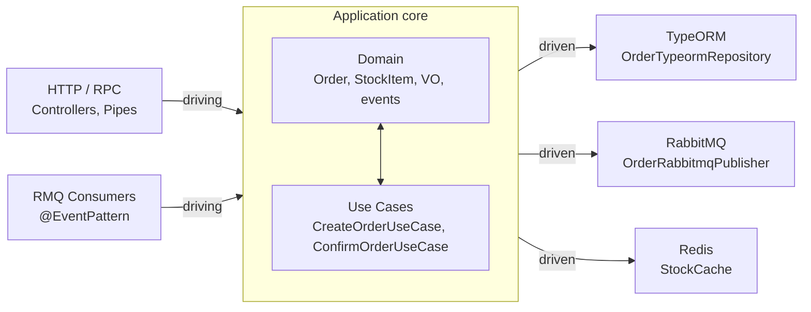
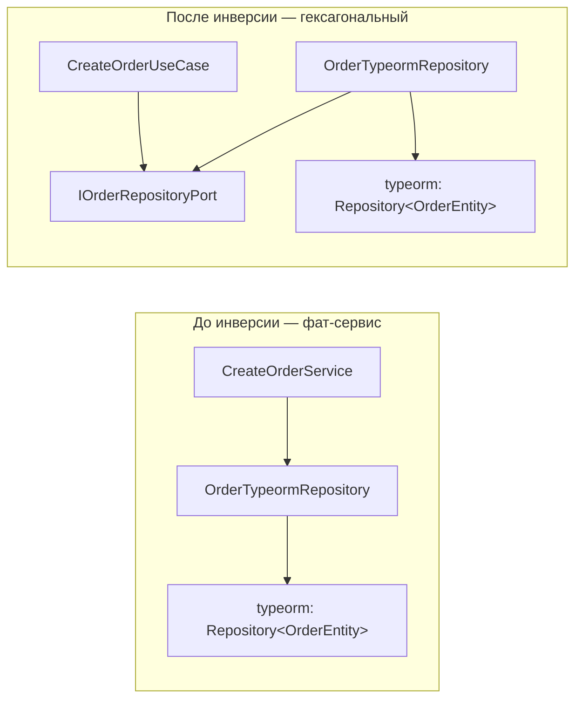

# Гексагональная архитектура (Ports & Adapters)

> [!abstract] Кратко
> Гексагональная архитектура (она же Ports & Adapters) — это способ
> построения приложения, в котором бизнес-логика общается с внешним
> миром только через интерфейсы-порты, а конкретные реализации этих
> интерфейсов (TypeORM-репозитории, RabbitMQ-клиенты, Redis-кэши)
> прячутся под адаптерами на краю системы. Retail Inventory System
> применяет этот паттерн на уровне каждого модуля: `domain/` ничего не
> знает про NestJS и TypeORM, `application/` зависит только от портов,
> `infrastructure/` содержит единственное место, где разрешено
> импортировать `Repository<...>` и `ClientProxy`. См. ADR-004.

## Проблема, которую решает

До миграции каждый сервис в проекте имел плоскую структуру
`app/api/<feature>/`: внутри жили per-action классы `*-service.ts`,
которые инжектили одновременно `Repository<X>`, `ClientProxy`, `Cache`
и Pino-логгер. Граница между бизнес-правилами и инфраструктурой
существовала только в виде договорённостей в код-ревью — компилятор её
не проверял.

Что это давало на практике:

- **Невозможно протестировать use-case без TypeORM.** Чтобы покрыть
  unit-тестом «создание заказа», приходилось мокать
  `Repository<OrderEntity>` per call. Мок жил в `__mocks__/typeorm.ts`
  и быстро рассинхронизировался с реальной семантикой ORM.
- **Контракт между сервисами «протекал» через транспорт.** Когда
  retail-сервис вызывал inventory, он держал тот же `ClientProxy`, что
  и сам inventory; «бизнес-факт» («подтверди заказ») и «технический
  факт» («отправить сообщение в очередь `inventory_queue`») были
  одним и тем же объектом.
- **Кросс-cutting concerns — каждый раз заново.** Каждый новый
  поперечный сервис (трейсинг, кэш, нотификации) приходилось
  «вшивать» прямо в `*-service.ts`. Это размазывало OTel-span'ы по
  бизнес-логике и приводило к двойной невидимой связности.

ADR-004 поставил цель: сделать так, чтобы **бизнес-логика не зависела
от инфраструктуры** даже на уровне импортов. Способ, который выбрали
из обзора NestJS-шаблонов в `recommendation.md` — это гексагональная
архитектура Алистера Кокберна (Alistair Cockburn, 2005), реализованная
в форме per-module hexagonal layout.

## Концепция

### Гексагон

Метафора Кокберна звучит так: приложение — это шестиугольник.
Внутри шестиугольника находится **бизнес-логика** (domain + use cases).
На каждой грани приоткрыто отверстие — **порт**. Через порт
бизнес-логика общается с внешним миром: с базой данных, очередью,
HTTP-клиентом, кэшем, файловой системой, тестовым фреймворком. Снаружи
к каждому порту прикручен **адаптер** — конкретная реализация под
конкретную технологию.



Ключевое отличие от слоистой архитектуры старого образца: **направление
зависимости не «сверху вниз», а «снаружи внутрь»**. Контроллеры зависят
от use-cases, use-cases — от портов, адаптеры — от портов; **порты не
зависят ни от чего, кроме domain-типов и DDD-примитивов**.

### Drivers и driven (входящие и исходящие порты)

В терминологии Кокберна порты делятся на две группы:

- **Driving ports (primary, входящие)** — те, через которые внешний
  мир «дёргает» приложение. В нашем случае это HTTP-контроллеры
  (`OrderController` в gateway), RPC-handler'ы внутри микросервисов
  (`@MessagePattern`), RMQ-consumer'ы (`@EventPattern`).
- **Driven ports (secondary, исходящие)** — те, через которые
  приложение «дёргает» внешний мир. В нашем коде это
  `IOrderRepositoryPort`, `IOrderEventsPublisherPort`,
  `IInventoryConfirmGatewayPort`, `IStockCachePort`, `INotifierPort`.

Driving-порт в типичной Nest-реализации не представлен отдельным
TypeScript-интерфейсом — это сам use-case-класс (контроллер вызывает
`useCase.execute(...)`). Driven-порт всегда явный интерфейс с
DI-токеном (`ORDER_REPOSITORY`, `STOCK_CACHE`, `NOTIFIER`).

### Dependency inversion

Без инверсии зависимостей use-case импортировал бы
`OrderTypeormRepository` напрямую — и это связало бы его с TypeORM на
уровне типов:



После инверсии и use-case, и адаптер зависят от **одной и той же
абстракции** — порта. В подходе Nest DI это означает, что use-case
объявляет `@Inject(ORDER_REPOSITORY)`, а модуль-композитор связывает
символ с конкретным провайдером:

```typescript
// apps/retail-microservice/src/modules/orders/orders.module.ts
providers: [
  { provide: ORDER_REPOSITORY, useClass: OrderTypeormRepository },
  // ...
]
```

В тесте мы подставляем in-memory-двойник вместо
`OrderTypeormRepository`, и use-case ничего не замечает.

### Когда применять, когда нет

Гексагональная архитектура **окупается**, когда:

- Есть нетривиальная бизнес-логика (инварианты заказа, бронирование
  стока, расчёт цен). Если код — голый CRUD, паттерн добавит
  церемонии без отдачи.
- Технологический стек может меняться (MySQL → Postgres, RabbitMQ →
  Kafka, Redis → Memcached) или вы хотите такую возможность сохранить.
- Нужно писать unit-тесты на бизнес-сценарии без поднятия БД и
  брокера.
- Есть несколько «driving»-каналов: HTTP + RMQ + scheduled job —
  паттерн позволяет переиспользовать use-case под все три без
  дублирования.

И **избыточна**, когда:

- Сервис — это тонкий BFF или прокси без собственной логики.
- Кодовая база — короткоживущий MVP, где «выкинуть и переписать»
  дешевле, чем поддерживать слои.
- Команда не понимает разницы между «модель домена» и «entity ORM» —
  паттерн без этого понимания вырождается в анемичные сущности +
  бесполезные интерфейсы.

В нашем проекте все четыре сервиса используют один и тот же скелет, в
том числе те, чья логика тонка (notification, gateway). Это решение
ADR-004 сознательно: «однообразие важнее точечной экономии», поскольку
архитектурный линт (ADR-017) работает только при едином шаблоне.

## Применение в проекте

В Retail Inventory System гексагональная архитектура применена
**внутри каждого модуля** (per-module hexagonal). Слои выкладываются
ровно по четырём папкам:

```
apps/<service>/src/modules/<module>/
├── domain/          # framework-free: aggregates, VOs, events, doman services
├── application/
│   ├── ports/       # I<Aggregate>RepositoryPort, I<…>PublisherPort, …
│   ├── use-cases/   # CreateOrderUseCase, ConfirmOrderUseCase, …
│   └── dto/         # *.command.ts, *.query.ts, *.view.ts
├── infrastructure/  # TypeORM-репозитории, RMQ-publisher'ы, Redis-cache, http-клиенты
└── presentation/    # HTTP controllers / @MessagePattern handlers, pipes
```

### Triple: domain → port → adapter

Каноничный пример — модуль `orders` в retail-микросервисе.

#### 1. Domain (никаких импортов фреймворка)

```typescript
// apps/retail-microservice/src/modules/orders/domain/order.model.ts
import { OrderStatusEnum } from '@retail-inventory-system/contracts';
import { AggregateRoot } from '@retail-inventory-system/ddd';

// Order aggregate root. Invariants enforced here:
//   - line items array is non-empty (an empty order cannot exist)
//   - `confirm()` is rejected when the header status is already CONFIRMED
//   - line-item statuses only ever transition PENDING → CONFIRMED
export class Order extends AggregateRoot<number | null> {
  // ...
  public static create(props: {
    customer: CustomerRef;
    lines: { productId: number; quantity: number }[];
  }): Order { /* … */ }
  public applyInventoryConfirmation(confirmedOrderProductIds: number[]): IOrderConfirmationResult { /* … */ }
}
```

> [GitHub: apps/retail-microservice/src/modules/orders/domain/order.model.ts](https://github.com/eugesher/retail-inventory-system/blob/84b1507c68fd9ee02b185eef3c4594b6fe02f664/apps/retail-microservice/src/modules/orders/domain/order.model.ts#L1-L88)

Импорты — только `@retail-inventory-system/contracts` (enum-типы) и
`@retail-inventory-system/ddd` (`AggregateRoot`). Никакого
`@nestjs/*`, никакого `typeorm`, никакого `class-validator`. Это
проверяется линтом: см. `eslint.config.mjs:273-292`.

#### 2. Port (интерфейс — единственный «знакомый» тип use-case'а)

```typescript
// apps/retail-microservice/src/modules/orders/application/ports/order.repository.port.ts
export const ORDER_REPOSITORY = Symbol('ORDER_REPOSITORY');

export interface IOrderRepositoryPort {
  findById(id: number): Promise<Order | null>;
  findHeaderById(id: number): Promise<{ statusId: Order['statusId'] } | null>;
  findOrderResponse(id: number): Promise<OrderConfirmResponseDto | null>;
  findConfirmableOrder(id: number): Promise<Omit<IOrderConfirm, 'correlationId'> | null>;
  customerExists(customerId: number): Promise<boolean>;
  findExistingProductIds(productIds: number[]): Promise<number[]>;
  save(order: Order): Promise<Order>;
  confirmLines(payload: { /* … */ }): Promise<void>;
}
```

> [GitHub: apps/retail-microservice/src/modules/orders/application/ports/order.repository.port.ts](https://github.com/eugesher/retail-inventory-system/blob/84b1507c68fd9ee02b185eef3c4594b6fe02f664/apps/retail-microservice/src/modules/orders/application/ports/order.repository.port.ts#L1-L49)

Порт — это **контракт**, а не «обёртка над репозиторием». Методы
сформулированы в терминах предметной области (`findConfirmableOrder`,
`confirmLines`), а не в терминах TypeORM (нет `find({ where, relations
})`, нет `QueryBuilder`). Use-case рассуждает про заказ, а не про
строки таблиц.

Символ `ORDER_REPOSITORY` — DI-токен. Use-case инжектит **именно
символ**, не класс; это важно для подмены в тестах и для того, чтобы
линт мог запретить импорт `OrderTypeormRepository` из use-case-слоя.

#### 3. Adapter (единственное место, где живёт TypeORM)

```typescript
// apps/retail-microservice/src/modules/orders/infrastructure/persistence/order-typeorm.repository.ts
@Injectable()
export class OrderTypeormRepository implements IOrderRepositoryPort {
  constructor(
    @InjectRepository(OrderEntity) private readonly orderRepository: Repository<OrderEntity>,
    @InjectRepository(CustomerEntity) private readonly customerRepository: Repository<CustomerEntity>,
    @InjectDataSource() private readonly dataSource: DataSource,
    @InjectPinoLogger(OrderTypeormRepository.name) private readonly logger: PinoLogger,
  ) {}

  public async findById(id: number): Promise<OrderDomain | null> {
    const entity = await this.orderRepository.findOne({
      where: { id },
      relations: { products: true },
    });
    return entity ? OrderMapper.toDomain(entity) : null;
  }
  // ...
}
```

> [GitHub: apps/retail-microservice/src/modules/orders/infrastructure/persistence/order-typeorm.repository.ts](https://github.com/eugesher/retail-inventory-system/blob/84b1507c68fd9ee02b185eef3c4594b6fe02f664/apps/retail-microservice/src/modules/orders/infrastructure/persistence/order-typeorm.repository.ts#L1-L50)

Адаптер реализует порт (`implements IOrderRepositoryPort`), импортирует
`typeorm`, `nestjs-pino`, TypeORM-entity, маппер. Здесь и только здесь
живёт «знание о реляционной природе хранилища». Если завтра мы
переедем с MySQL на DynamoDB, изменится этот файл, а не Order или
CreateOrderUseCase.

Маппер `OrderMapper` отвечает за перевод между TypeORM-entity и
domain-моделью — см. [[mappers-and-repositories]]. На стыке мы теряем
часть «удобства» (две формы одного и того же), но получаем
независимость domain-модели от реляционных артефактов вроде join'ов,
каскадов и lazy-relations.

### Adapter как место для side effects

Не только репозиторий — любой выход в инфраструктуру оформляется как
порт + адаптер. В модуле `orders` их три:

- `IOrderRepositoryPort` → `OrderTypeormRepository` — персистентность;
- `IOrderEventsPublisherPort` → `OrderRabbitmqPublisher` — публикация
  событий `retail.order.created/confirmed/cancelled` в RabbitMQ;
- `IInventoryConfirmGatewayPort` → `InventoryConfirmRabbitmqAdapter` —
  кросс-сервисный RPC к inventory (`inventory.order.confirm`).

В use-case'е они инжектятся бок о бок:

```typescript
// apps/retail-microservice/src/modules/orders/application/use-cases/create-order.use-case.ts
constructor(
  @Inject(ORDER_REPOSITORY)
  private readonly repository: IOrderRepositoryPort,
  @Inject(ORDER_EVENTS_PUBLISHER)
  private readonly publisher: IOrderEventsPublisherPort,
  @InjectPinoLogger(CreateOrderUseCase.name)
  private readonly logger: PinoLogger,
) {}
```

> [GitHub: apps/retail-microservice/src/modules/orders/application/use-cases/create-order.use-case.ts](https://github.com/eugesher/retail-inventory-system/blob/84b1507c68fd9ee02b185eef3c4594b6fe02f664/apps/retail-microservice/src/modules/orders/application/use-cases/create-order.use-case.ts#L19-L27)

`PinoLogger` — единственное исключение из правила «use-case импортирует
только порты». Это сознательная уступка: альтернатива (`ILoggerPort` +
адаптер) дала бы ноль гибкости (логгер всё равно один), но раздула бы
DI-граф. То же исключение зафиксировано в правилах линта: см.
`eslint.config.mjs:298-316`.

### Что охраняет границу

Архитектурный линт `eslint-plugin-boundaries` (ADR-017) запрещает на
уровне компиляции:

- `domain/` → `@nestjs/*`, `typeorm`, `nestjs-pino`, любые
  RMQ/Redis-клиенты;
- `application/use-cases/` → `@nestjs/typeorm`, `cache-manager`,
  `amqplib` (use-case не знает, в какую таблицу/очередь его данные
  попадут);
- `application/ports/` → почти всё, кроме типов из `lib-ddd` и
  `lib-contracts`;
- `presentation/` → `typeorm`, `@keyv/redis`, `cache-manager` (HTTP-
  и RMQ-контроллеры не должны лезть в кеш или БД мимо use-case'а).

Правила и element-types определены в `eslint.config.mjs`; подробнее в
статье [[module-boundaries]]. Это и есть тот «забор», без которого
гексагон через полгода разваливается под давлением «срочных правок».

## Анти-паттерны, которые он не решает сам по себе

Гексагональная архитектура — это **структурный** паттерн. Она не
гарантирует:

- **Богатую модель домена.** Можно построить порты и адаптеры вокруг
  анемичной модели (`Order` — это набор getter/setter без поведения),
  и use-case всё равно будет делать всю работу — мы получим
  «гексагональный transaction script». Антидот — DDD-тактика;
  см. [[domain-driven-design]].
- **Отсутствие протечек.** TypeORM-entity легко проникает в use-case
  через тип «лишнего поля» или через `DeepPartial<Entity>`-параметр.
  Антидот — маппер на каждой границе и анти-corruption layer там,
  где это не наш тип; см. [[entity-vs-domain-model]] и
  [[mappers-and-repositories]].
- **Идеальную тестируемость.** Если adapter содержит «умную» SQL-
  логику (например, recursive CTE), её всё равно надо тестировать
  против настоящей БД. Гексагон выделяет такое место явно, но не
  отменяет необходимость e2e/integration-тестов.

## Связанные решения

- [[clean-architecture-layers]] — как ровно те же четыре слоя
  раскладываются по правилам зависимости внутрь.
- [[domain-driven-design]] — что класть внутрь `domain/`, чтобы порты
  были богаты по содержанию, а не по форме.
- [[module-boundaries]] — `eslint-plugin-boundaries` и правила,
  которые удерживают шестиугольник от схлопывания.
- [[mappers-and-repositories]] — детали реализации репозитория-
  адаптера и роль `*.mapper.ts` на границе.
- [[entity-vs-domain-model]] — почему TypeORM-`@Entity` живёт только
  в `infrastructure/persistence/`, а domain-модель остаётся
  framework-free.

## Глоссарий

| Термин (EN)             | Перевод / пояснение (RU)                                                                                                                                                                                                                                                                                                              |
| ----------------------- | ------------------------------------------------------------------------------------------------------------------------------------------------------------------------------------------------------------------------------------------------------------------------------------------------------------------------------------ |
| Port                    | Порт — TypeScript-интерфейс, описывающий, **что** приложение умеет (driving) или **что ему нужно** от внешнего мира (driven). Не знает, какая технология за ним стоит.                                                                                                                                                                |
| Adapter                 | Адаптер — реализация порта под конкретную технологию: `OrderTypeormRepository` для TypeORM, `OrderRabbitmqPublisher` для RMQ, `LogNotifierAdapter` для stdout. Живёт в `infrastructure/`.                                                                                                                                              |
| Driving port (primary)  | Входящий порт — то, через что мир дёргает приложение: HTTP-контроллер, RPC-handler, RMQ-consumer. В Nest-реализации часто совпадает с самим use-case-классом.                                                                                                                                                                          |
| Driven port (secondary) | Исходящий порт — то, через что приложение дёргает мир: репозиторий, publisher, кэш, нотификатор. Всегда явный интерфейс + DI-токен.                                                                                                                                                                                                  |
| Dependency inversion    | Инверсия зависимостей — принцип, при котором и высокоуровневый модуль (use-case), и низкоуровневый (адаптер) зависят от **одной и той же абстракции** (порта), а не первый от второго. Реализуется через DI-контейнер NestJS.                                                                                                          |
| Hexagonal core          | «Ядро» гексагона — domain + application. Всё, что вне ядра, — адаптеры, фреймворк, транспорт.                                                                                                                                                                                                                                          |
| Anti-corruption layer   | Слой защиты от чужой модели. В нашем коде роль ACL играет маппер (`OrderMapper`, `StockItemMapper`) — он не пускает TypeORM-форму в domain.                                                                                                                                                                                            |
| Transaction script      | Анти-паттерн: вся бизнес-логика — пошаговый сценарий внутри одного метода use-case'а, а domain-модель — голые данные. Гексагональный layout не запрещает его, но делает уязвимость очевидной (use-case на 200 строк выпадает из визуального шаблона).                                                                                  |

## Что почитать дальше

- Alistair Cockburn — *Hexagonal Architecture* (2005, оригинальная
  статья): <https://alistair.cockburn.us/hexagonal-architecture/>.
- Vaughn Vernon — *Implementing Domain-Driven Design* (Addison-Wesley,
  2013), главы 4 и 7 — про port/adapter в DDD-контексте.
- ADR-004 — [`docs/adr/004-adopt-hexagonal-architecture-per-service.md`](https://github.com/eugesher/retail-inventory-system/blob/84b1507c68fd9ee02b185eef3c4594b6fe02f664/docs/adr/004-adopt-hexagonal-architecture-per-service.md)
  — обоснование выбора паттерна для этого проекта.
- ADR-009 — [`docs/adr/009-port-adapter-at-the-gateway.md`](https://github.com/eugesher/retail-inventory-system/blob/84b1507c68fd9ee02b185eef3c4594b6fe02f664/docs/adr/009-port-adapter-at-the-gateway.md)
  — приложение паттерна к API-gateway, где «бизнес-логики» почти нет,
  но шаблон сохраняется ради единообразия.

> [!faq]- Проверь себя
>
> 1. В каком слое разрешено импортировать `typeorm`? А `@nestjs/common`?
> 2. Чем driving-порт отличается от driven-порта? Приведи по одному
>    примеру каждого из модуля `orders` или `stock`.
> 3. Use-case инжектит `ORDER_REPOSITORY` как символ, а не как класс
>    `OrderTypeormRepository`. Почему это важно для тестирования? Что
>    случится, если поменять на класс?
> 4. Почему `PinoLogger` разрешён в `application/use-cases/`, а
>    `Repository<OrderEntity>` — нет?
> 5. В чём отличие per-module hexagonal от классического «один
>    сервис = один гексагон»? Какие плюсы и минусы у нашего варианта?
