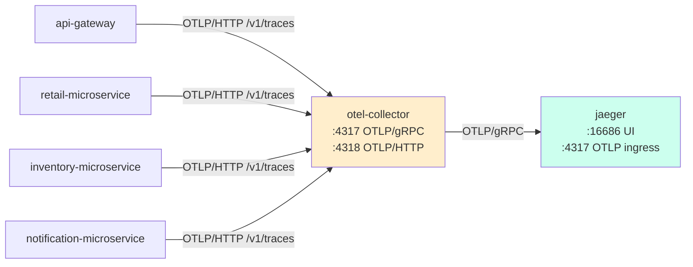

# Jaeger как бэкенд трейсов

> [!abstract] Кратко
> Локальный observability-стек — это **два** контейнера в
> отдельном compose-оверлее: `otel/opentelemetry-collector-contrib`
> на `:4317`/`:4318` и `jaegertracing/all-in-one` на `:16686`
> (UI). Приложения шлют OTLP/HTTP на `otel-collector:4318/v1/traces`,
> коллектор batch'ит и пересылает на `jaeger:4317`. Конфигурация
> коллектора — один YAML в `infrastructure/otel-collector-config.yaml`,
> переключение на vendor (Honeycomb/Tempo/Datadog) — это смена
> `exporters:` в нём, **не** изменение приложений.
> `@opentelemetry/instrumentation-amqplib` инжектит `traceparent`
> в AMQP-properties, и trace `gateway → retail → inventory →
> notification` остаётся **одним** деревом, несмотря на три
> хопа через RabbitMQ. ADR-014.

## Проблема, которую решает

Когда [ADR-007](https://github.com/eugesher/retail-inventory-system/blob/84b1507c68fd9ee02b185eef3c4594b6fe02f664/docs/adr/007-pino-and-opentelemetry.md)
зафиксировал OTel, осталось четыре конкретных вопроса:

1. **Каким exporter-протоколом** SDK отдаёт span'ы наружу
   из Node-процессов?
2. **Куда** эти span'ы приземляются в локальном dev'е?
3. **Как** прод-конфигурация подключится к vendor-бэкенду, не
   меняя кода приложения?
4. **Как** trace остаётся одним деревом сквозь четыре сервиса,
   три из которых соединены RabbitMQ-хопами?

[ADR-014](https://github.com/eugesher/retail-inventory-system/blob/84b1507c68fd9ee02b185eef3c4594b6fe02f664/docs/adr/014-otel-exporter-otlp-http-and-jaeger.md)
отвечает: **OTLP/HTTP** → **otel-collector** → **Jaeger**,
плюс auto-instrumentation amqplib для cross-service-thread'а.

## Концепция

### Топология стека



Четыре сервиса шлют OTLP/HTTP, **один** коллектор аккумулирует,
batch'ит и перешлёт в Jaeger. UI — на хосте по `:16686`.
В prod — та же топология, только `jaeger` заменяется на vendor.

### Почему OTLP/HTTP, а не gRPC или Jaeger-thrift

Из [ADR-014](https://github.com/eugesher/retail-inventory-system/blob/84b1507c68fd9ee02b185eef3c4594b6fe02f664/docs/adr/014-otel-exporter-otlp-http-and-jaeger.md)
§«OTLP/HTTP, not gRPC or Jaeger-thrift»:

- **OTLP/HTTP** — одна зависимость (`@opentelemetry/exporter-trace-otlp-http`),
  никаких native-сборок. gRPC потащил бы `@grpc/grpc-js`,
  protobuf-codegen, **и** проще-проще дебажить `curl -X POST`
  против `:4318`, чем `tcpdump` против gRPC.
- **Jaeger-thrift** — legacy-формат. Jaeger 1.62 (наш image) и
  выше **принимает OTLP напрямую**, и индустрия отошла от
  thrift'а как от vendor-specific формата.
- **Identical end-state.** Коллектор турнит OTLP/HTTP в всё,
  что нужно дальше: Jaeger-OTLP, Tempo, Honeycomb, Datadog.
  Hot-path-латентность HTTP vs gRPC на наших volume'ах
  пренебрежимо мала.

### Почему коллектор стоит локально, хотя Jaeger принимает OTLP

Локально коллектор **не строго необходим** — Jaeger
all-in-one принимает OTLP напрямую. ADR-014 настаивает
держать коллектор по трём причинам:

- **Зеркало прод-топологии.** В проде апп никогда не ходит
  прямо в vendor — он ходит в sidecar-коллектор, который
  владеет batch, retries и upstream-протоколом. Если локально
  его выкинуть, получим **два** разных графа для дебага. Это
  риск, не выгода.
- **Batch.** Local-test'ы умеют выпустить десятки span'ов за
  сотни миллисекунд; `batch`-processor сглаживает их в один
  HTTP-запрос. Иначе — per-span roundtrip.
- **`debug`-exporter.** Коллектор пишет каждый span в stdout
  (`docker logs otel-collector`). Самый быстрый способ
  подтвердить «SDK реально шлёт» — посмотреть туда.

### Compose-оверлей, не main `docker-compose.yml`

```yaml
# docker-compose.observability.yml
services:
  jaeger:
    image: jaegertracing/all-in-one:1.62.0
    container_name: jaeger
    environment:
      COLLECTOR_OTLP_ENABLED: 'true'
    ports:
      - '16686:16686' # Jaeger UI
    networks:
      - backend

  otel-collector:
    image: otel/opentelemetry-collector-contrib:0.114.0
    container_name: otel-collector
    command: ['--config=/etc/otelcol-contrib/config.yaml']
    volumes:
      - ./infrastructure/otel-collector-config.yaml:/etc/otelcol-contrib/config.yaml:ro
    ports:
      - '4317:4317' # OTLP gRPC ingress
      - '4318:4318' # OTLP HTTP ingress
    depends_on:
      - jaeger
    networks:
      - backend
```

> [GitHub: docker-compose.observability.yml](https://github.com/eugesher/retail-inventory-system/blob/84b1507c68fd9ee02b185eef3c4594b6fe02f664/docker-compose.observability.yml#L1-L27)

Поднимаем командой:

```bash
docker compose -f docker-compose.yml -f docker-compose.observability.yml up
```

Почему отдельный файл, а не один `docker-compose.yml`:

- **Opt-in.** Большинство local-dev-сессий не нужен Jaeger;
  его образ ~250 MB.
- **Shared network.** Оба файла используют общую сеть
  `backend`, определённую в основном compose; URL'ы вида
  `otel-collector:4318` работают неизменно, когда оверлей
  поднят.
- **Тесты без трейсинга** не платят boot-cost'ом за Jaeger.

### Конфиг коллектора: single pipeline

```yaml
# infrastructure/otel-collector-config.yaml
receivers:
  otlp:
    protocols:
      grpc:
        endpoint: 0.0.0.0:4317
      http:
        endpoint: 0.0.0.0:4318

processors:
  batch:
    timeout: 1s
    send_batch_size: 512

exporters:
  otlp/jaeger:
    endpoint: jaeger:4317
    tls:
      insecure: true
  debug:
    verbosity: basic

service:
  pipelines:
    traces:
      receivers: [otlp]
      processors: [batch]
      exporters: [otlp/jaeger, debug]
```

> [GitHub: infrastructure/otel-collector-config.yaml](https://github.com/eugesher/retail-inventory-system/blob/84b1507c68fd9ee02b185eef3c4594b6fe02f664/infrastructure/otel-collector-config.yaml#L1-L27)

Одна pipeline, три блока:

- **`receivers.otlp`** — принимает gRPC (`:4317`) и HTTP
  (`:4318`). У нас приложения шлют HTTP (см. `tracer.ts`'s
  `OTLPTraceExporter` — он по умолчанию HTTP).
- **`processors.batch`** — буферизует span'ы. `timeout: 1s` —
  если за секунду собралось `< 512` span'ов, всё равно
  flush'имся; иначе — по достижении 512.
- **`exporters`** — два получателя:
  - **`otlp/jaeger`** — собственно Jaeger по OTLP/gRPC
    (`jaeger:4317`). `tls.insecure: true` — внутри docker-сети,
    TLS избыточен.
  - **`debug`** — `docker logs otel-collector` для сэмплов
    каждого span'а.

**Замена бэкенда — это смена этого YAML, не кода приложения.**
Заменили `otlp/jaeger.endpoint` на `api.honeycomb.io:443` +
добавили `headers: { x-honeycomb-team: ... }` — и span'ы
полетели в Honeycomb. Apps не знают.

### Env-vars в `docker-compose.yml`

Каждый сервис задаёт `OTEL_SERVICE_NAME` и
`OTEL_EXPORTER_OTLP_ENDPOINT`. Извлекаем из основного compose'а:

```yaml
# docker-compose.yml (фрагмент для api-gateway)
environment:
  # ...
  OTEL_SERVICE_NAME: api-gateway
  OTEL_EXPORTER_OTLP_ENDPOINT: http://otel-collector:4318/v1/traces
```

> [GitHub: docker-compose.yml](https://github.com/eugesher/retail-inventory-system/blob/84b1507c68fd9ee02b185eef3c4594b6fe02f664/docker-compose.yml#L73-L76)

Аналогично для inventory (`OTEL_SERVICE_NAME=inventory-microservice`),
retail (`OTEL_SERVICE_NAME=retail-microservice`),
notification (`OTEL_SERVICE_NAME=notification-microservice`):

> [GitHub: docker-compose.yml (inventory)](https://github.com/eugesher/retail-inventory-system/blob/84b1507c68fd9ee02b185eef3c4594b6fe02f664/docker-compose.yml#L104-L105)
> [GitHub: docker-compose.yml (notification)](https://github.com/eugesher/retail-inventory-system/blob/84b1507c68fd9ee02b185eef3c4594b6fe02f664/docker-compose.yml#L133-L134)
> [GitHub: docker-compose.yml (retail)](https://github.com/eugesher/retail-inventory-system/blob/84b1507c68fd9ee02b185eef3c4594b6fe02f664/docker-compose.yml#L162-L163)

Endpoint — `http://otel-collector:4318/v1/traces`. Хост
`otel-collector` резолвится в shared `backend`-сети только когда
оверлей поднят. Если запустить `docker-compose.yml` без
оверлея — приложения попробуют шлять трейсы в несуществующий
хост, OTel в логи выпишет error'ы соединения, но приложения
не упадут (это by design: трейсинг — non-essential, ошибка
exporter'а не должна валить сервис).

### Joi-схема: что обязательно

```typescript
// libs/config/config-module.config.ts
OTEL_SERVICE_NAME: Joi.string().required(),
OTEL_EXPORTER_OTLP_ENDPOINT: Joi.string()
  .uri({ scheme: ['http', 'https'] })
  .required(),
OTEL_RESOURCE_ATTRIBUTES: Joi.string().optional(),
OTEL_SDK_DISABLED: Joi.boolean().default(false),
```

> [GitHub: libs/config/config-module.config.ts](https://github.com/eugesher/retail-inventory-system/blob/84b1507c68fd9ee02b185eef3c4594b6fe02f664/libs/config/config-module.config.ts#L39-L44)

Обязательны: `OTEL_SERVICE_NAME` (имя для Jaeger UI),
`OTEL_EXPORTER_OTLP_ENDPOINT` (URL коллектора). Без них Joi
бракует boot — сервис не стартует. Это правильно: трейсы без
service-name бесполезны.

### Cross-service trace через RabbitMQ

Самое интересное наблюдение про этот стек — что
**три из четырёх** хопов проходят через RabbitMQ, и тем не
менее в Jaeger UI мы видим **одно** дерево:

```
trace 1a2b…
└─ POST /api/order/:id/confirm        ← api-gateway, HTTP
   ├─ retail_queue publish              ← api-gateway, AMQP
   │  └─ retail.order.confirm process   ← retail-microservice, AMQP
   │     ├─ TypeORM: UPDATE orders      ← retail, mysql2
   │     ├─ inventory_queue publish     ← retail, AMQP
   │     │  └─ inventory.order.confirm process ← inventory, AMQP
   │     │     └─ TypeORM: UPDATE product_stock ← inventory, mysql2
   │     └─ notification_events publish ← retail, AMQP
   │        └─ retail.order.confirmed process ← notification, AMQP
   └─ HTTP 200 response                 ← api-gateway
```

Это работает благодаря
[`@opentelemetry/instrumentation-amqplib`](https://www.npmjs.com/package/@opentelemetry/instrumentation-amqplib)
(подробно в [[lib-opentelemetry-instrumentation-amqplib]]),
который **инжектит** `traceparent` в `properties.headers`
AMQP-message'а на `publish`, и **извлекает** его на `consume`.
Без этой инструментации мы бы получили **четыре независимых
trace'а** — по одному per сервис, никак не связанных. Это
самая важная инструментация в bundle'е
`@opentelemetry/auto-instrumentations-node` (см.
[[lib-opentelemetry-auto-instrumentations-node]]) — без неё
вся цепочка [[message-vs-event-patterns]] / [[rabbitmq-as-bus]]
была бы видима как разрозненные «острова».

В `package.json` мы используем `amqp-connection-manager` —
обёртку над `amqplib` для auto-reconnect. Инструментация
ловит amqplib-Channel'ы под капотом обёртки, так что патчинг
работает прозрачно. Подтверждено манульным smoke-тестом в
task-10 ([carryover-10](https://github.com/eugesher/retail-inventory-system/blob/84b1507c68fd9ee02b185eef3c4594b6fe02f664/docs/architecture-migration-plan/tasks/_carryover-10.md)
§8 #3): `PUT /api/order/:id/confirm` даёт один trace со
span'ами всех четырёх сервисов.

### Артефакт: notification-consumer ~62s

[carryover-10](https://github.com/eugesher/retail-inventory-system/blob/84b1507c68fd9ee02b185eef3c4594b6fe02f664/docs/architecture-migration-plan/tasks/_carryover-10.md)
§8 #3 зафиксировал baseline-наблюдение: **`process`-span
notification-consumer'а часто показывает в Jaeger UI длительность
~62 секунды**, даже если сама handler-логика отрабатывает за
~10ms. Это **не настоящая** латентность; это особенность
того, как `instrumentation-amqplib` закрывает consumer-span'ы:
он привязывает их к `channel.ack` / `channel.nack`, и в нашей
конфигурации channel держит span открытым до timeout'а
`amqp-connection-manager`. Реальное время handler'а ищется
во **внутренних** span'ах (TypeORM, Redis, business-logic).

Это **открытый артефакт**, не блокер; описан в ADR-014
«Consequences» как «accept noise for now, span-attribute-based
filtering follow-up». Если приятный глазам Jaeger важен —
включается filter в коллектор'е (filter out spans с
длительностью больше X для конкретных span-name'ов).

### Production swap: что меняется

Перевод на vendor — единственная мутация YAML коллектора:

```yaml
# infrastructure/otel-collector-config.yaml (prod, гипотетика)
exporters:
  otlp/honeycomb:
    endpoint: api.honeycomb.io:443
    headers:
      x-honeycomb-team: ${env:HONEYCOMB_API_KEY}

service:
  pipelines:
    traces:
      receivers: [otlp]
      processors: [batch]
      exporters: [otlp/honeycomb]
```

App-код **не меняется**. `OTEL_EXPORTER_OTLP_ENDPOINT`
остаётся `http://<collector-host>:4318/v1/traces`. Это и есть
**main benefit** OTLP-через-коллектор: vendor-neutrality на
уровне приложения. См. ADR-014 «Alternatives» — direct vendor
SDK был отвергнут именно потому, что нарушает это.

## Применение в проекте

### Smoke-тест трейсинга локально

Реальная процедура для дебага «работает ли OTel»:

1. Поднять оверлей:
   `docker compose -f docker-compose.yml -f docker-compose.observability.yml up`.
2. Дождаться, пока в логах `otel-collector` появятся строчки
   `debug` exporter'а — это значит span'ы приходят.
3. Сделать запрос на gateway:
   `curl -X POST http://localhost:3000/api/order ...`.
4. Открыть `http://localhost:16686`, выбрать service
   `api-gateway`, нажать `Find Traces` — должен появиться
   trace с span'ами всех затронутых сервисов.

Если шаг 2 проходит, а шаг 4 — нет, проблема в коллекторе
(filter, exporter-config). Если шаг 2 не проходит, проблема в
приложении: либо `OTEL_EXPORTER_OTLP_ENDPOINT` указывает не
туда, либо `tracer.ts` не импортирован первой строкой
([[opentelemetry-overview]]'s «правило первой строки»).

### Что в логе должно подтверждать

Если все три ID (`correlationId`, `traceId`, `spanId`) есть в
строке лога, это значит:

- `correlationId` → middleware на gateway работает
  ([[pino-logging]]);
- `traceId` + `spanId` → `tracer.ts` запустил SDK, hook
  читает активный span ([[trace-log-correlation]]);
- эти ID совпадут с тем, что увидите в Jaeger UI.

Один и тот же `traceId` в логах четырёх сервисов означает,
что `traceparent` пробросился через RabbitMQ. Если значения
отличаются — проблема в `instrumentation-amqplib` (или в
ручном publish'е, обходящем `amqp-connection-manager`).

## Связанные решения

- [[opentelemetry-overview]] — что такое span / trace /
  propagation; правило первой строки.
- [[pino-logging]] — параллельная плоскость; `correlationId`-thread.
- [[trace-log-correlation]] — hook, который связывает Pino-record
  и активный span.
- [[lib-opentelemetry-exporter-trace-otlp-http]] — пакет, который
  сериализует span'ы в OTLP/HTTP и шлёт на коллектор.
- [[lib-opentelemetry-instrumentation-amqplib]] — пакет, который
  делает cross-service-trace одним деревом.
- [[lib-opentelemetry-auto-instrumentations-node]] — bundle, в
  который amqplib-инструментация входит.
- [[shared-libs-philosophy]] — почему конфиг и tracer лежат в
  `libs/observability`.
- [[message-vs-event-patterns]] — оба класса RMQ-сообщений
  получают span'ы; ни один не «выпадает» из trace'а.
- [[rabbitmq-as-bus]] — какие очереди существуют; как они
  отражаются в `publish`/`process` span'ах.

## Глоссарий

| Термин (EN) | Перевод / пояснение (RU) |
|---|---|
| Jaeger | OSS distributed tracing platform; collector + storage + UI. У нас — `jaegertracing/all-in-one:1.62.0`. |
| Jaeger UI | Web-интерфейс по `:16686`; список trace'ов, дерево span'ов, search. |
| OpenTelemetry Collector | Vendor-neutral агрегатор: receivers → processors → exporters. У нас — `otel/opentelemetry-collector-contrib:0.114.0`. |
| `otelcol-contrib` | Distribution-дистрибутив коллектора с дополнительными exporter'ами/receiver'ами. Мы используем именно contrib (на случай Honeycomb/Datadog в будущем). |
| OTLP | OpenTelemetry Protocol. Бинарный/JSON-формат span'ов; transport-агностичен (HTTP/gRPC). |
| OTLP/HTTP | OTLP over HTTP, по умолчанию `:4318`. У нас apps шлют сюда. |
| OTLP/gRPC | OTLP over gRPC, по умолчанию `:4317`. Коллектор → Jaeger ходит здесь. |
| `:4317` | Default-порт OTLP/gRPC. |
| `:4318` | Default-порт OTLP/HTTP. |
| `:16686` | Default-порт Jaeger UI. |
| `/v1/traces` | Path в OTLP/HTTP-эндпоинте; обязательный суффикс `OTEL_EXPORTER_OTLP_ENDPOINT`. |
| Receiver | Компонент коллектора, принимающий span'ы. У нас — `otlp` с двумя протоколами. |
| Processor | Компонент коллектора, трансформирующий span'ы. У нас — `batch`. |
| Exporter | Компонент коллектора, отправляющий span'ы наружу. У нас — `otlp/jaeger` и `debug`. |
| `batch` (processor) | Группирует span'ы в пакеты для эффективной отправки. `timeout: 1s` + `send_batch_size: 512`. |
| `debug` (exporter) | Печатает sample каждого span'а в stdout коллектора. Полезен для дебага. |
| `traceparent` | HTTP/AMQP-header W3C-формата; несёт `traceId`/`spanId`/`flags`. |
| amqplib | Underlying AMQP-client для Node. `amqp-connection-manager` — обёртка над ним. |
| `auto-instrumentations-node` | Bundle стандартных инструментаций; включает `instrumentation-amqplib`. |
| `instrumentation-amqplib` | Патч, инжектящий `traceparent` в AMQP-message-properties. Делает cross-service-trace однодеревным. |
| Compose-overlay | `-f` дополнительный compose-file, расширяющий основной. Используется для opt-in-сервисов. |
| Shared network (`backend`) | Docker-сеть из основного compose'а. Оверлей подключается в неё, поэтому `otel-collector:4318` резолвится. |
| `OTEL_SERVICE_NAME` | Env-var: имя сервиса в Resource. Жёсткое требование. |
| `OTEL_EXPORTER_OTLP_ENDPOINT` | Env-var: URL коллектора с обязательным суффиксом `/v1/traces`. |
| `tls.insecure: true` | YAML-флаг коллектора: не требовать TLS для in-network-связи. Только для local-dev. |
| Vendor swap | Замена бэкенда (Jaeger → Honeycomb/Tempo/Datadog) изменением `exporters:` в YAML коллектора. App-код не меняется. |
| Notification-consumer ~62s | Известный артефакт: `process`-span notification держится открытым до channel-timeout'а. Не настоящая латентность. |

> [!faq]- Проверь себя
> 1. Я запустил только `docker-compose.yml` (без оверлея).
>    Сервисы поднялись. Что увидит operator в логе
>    `api-gateway` через минуту?
> 2. Какую **одну** строку нужно изменить в
>    `docker-compose.yml`, чтобы все четыре сервиса начали
>    слать трейсы в Honeycomb напрямую (без коллектора)?
>    Какие ещё две строки нужно при этом обнулить?
> 3. В Jaeger UI вы видите span `notification.consumer`
>    длиной 62 секунды. Где смотреть реальное время
>    обработки сообщения?
> 4. Между gateway и retail трейс ходит через AMQP. Где
>    конкретно живёт `traceparent` в AMQP-сообщении?
> 5. Зачем коллектору и gRPC, и HTTP-receiver одновременно,
>    если apps шлют только HTTP?

## Что почитать дальше

- [Jaeger docs — OTLP ingestion](https://www.jaegertracing.io/docs/1.62/architecture/) —
  как Jaeger 1.62 принимает OTLP без thrift'а.
- [OpenTelemetry Collector docs](https://opentelemetry.io/docs/collector/) —
  receivers / processors / exporters; полная архитектура.
- [Collector configuration](https://opentelemetry.io/docs/collector/configuration/) —
  справочник по YAML-блокам, которые мы используем.
- [`amqp-connection-manager` wrapping `amqplib`](https://github.com/jwalton/node-amqp-connection-manager) —
  устройство wrapper'а; почему `amqplib`-instrumentation
  всё ещё работает.
