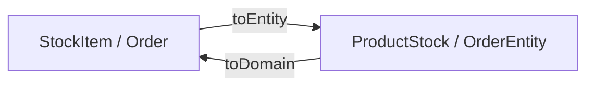

# Мапперы и репозитории

> [!abstract] Кратко
> Между domain-моделью и TypeORM-entity стоит **mapper** —
> класс со статическими методами `toDomain(entity)` (и где
> нужно `toEntity(domain)`). Между use case'ом и
> TypeORM-репозиторием стоит **port** —
> `IOrderRepositoryPort`, `IStockRepositoryPort` — описание
> persistence-контракта в терминах **домена**. Использование
> ports позволяет тестировать use case'ы без поднятия БД, а
> mapper'ы — без бизнес-логики. Adapter (например,
> `OrderTypeormRepository`) — единственная точка, где
> сходятся TypeORM и domain.

## Проблема, которую решает

Use case `ConfirmOrderUseCase` должен загрузить агрегат,
позвать на нём `applyInventoryConfirmation(...)`, и сохранить
изменения. Можно сделать это «в лоб»:

```typescript
// антипаттерн
const order = await orderRepository.findOne({ where: { id }, relations: { products: true } });
order.statusId = OrderStatusEnum.CONFIRMED;
await orderRepository.save(order);
```

Проблем три:

1. Use case **тащит TypeORM**. `Repository<TEntity>`,
   `FindOptionsRelations`, `OrderStatusEnum` как public-поле —
   всё это инфраструктурные понятия, протекающие в
   `application/`-слой.
2. **Невозможно протестировать без БД**. `Repository<OrderEntity>`
   — `@Injectable()`-singleton, привязанный к
   `DataSource`'у; чтобы написать unit-тест на use case,
   придётся либо bootstrap'ить TypeORM, либо мокать через
   `provide: getRepositoryToken(OrderEntity)`.
3. **Бизнес-инварианты теряются**. У `OrderEntity` нет
   `applyInventoryConfirmation(...)`-метода — он только в
   domain'е. Бизнес-логика растекается по use case'у или
   service'у, и domain-модель превращается в DTO.

ADR-004 (гексагональная архитектура) и ADR-019 (TypeORM/MySQL)
решают эту тройку через `port + adapter + mapper`:

- **Mapper** разделяет два мира на уровне типа.
- **Port** делает контракт persistence частью
  application-слоя.
- **Adapter** — единственное место, где `Repository<TEntity>` и
  domain-классы видят друг друга.

ADR-012 / ADR-013 формализуют этот triplet для inventory'я и
retail'а соответственно.

## Концепция

### Mapper



Это **функция направленного преобразования**. Никакой
бизнес-логики; никакого I/O; никакого state. Mapper —
**boundary**, не сервис.

Принципы:

- **Static-методы**. Mapper'у не нужен state — это чистая
  функция.
- **Расположение — `infrastructure/persistence/`**. Mapper
  имеет право знать оба мира (domain и entity), но
  *никто из domain'а не знает про mapper'ы*.
- **Один mapper на агрегат**. Mapper для root-агрегата
  (`OrderMapper`) умеет рекурсивно мэппить child-сущности
  (`OrderProductMapper.toDomain(...)` внутри
  `OrderMapper.toDomain(...)`), но обратно child-mapper из
  domain-слоя — нельзя.

### Repository port

Port — это `interface IXxxRepositoryPort`, описывающий
persistence-контракт в **терминах домена**:

- параметры — domain-классы и domain-VO;
- возвраты — domain-классы или DTO-контракты из
  `@retail-inventory-system/contracts`;
- никаких упоминаний `Repository<TEntity>`, `FindOptions`,
  `QueryBuilder`.

Также port владеет **DI-символом** (`ORDER_REPOSITORY = Symbol('ORDER_REPOSITORY')`),
через который use case инжектит implement'а.

### Adapter

Adapter — это `@Injectable()`-класс,
`implements IXxxRepositoryPort`, наследующийся от
`BaseTypeormRepository<TEntity, TDomain>` (см.
[[base-entity-and-base-repository]]). Здесь сходятся:

- `@InjectRepository(Entity)` — низкоуровневая ручка
  TypeORM-репозитория;
- `OrderMapper.toDomain(entity)` /
  `OrderMapper.toEntity(domain)` — конвертация;
- `TypeORM`-обвязка (`createQueryBuilder`, `manager.transaction`).

Adapter — **единственное** место в кодовой базе, где
`Repository<TEntity>` или `EntityManager` появляются за
пределами `domain/`. Линт-правило ADR-017 проверяет это.

### Зачем такое разделение

Тестирование: можно написать use case-спеку, в которой
`IOrderRepositoryPort` реализован in-memory'ным test double.
БД не поднимается; jest стартует за секунды; CI быстрый.

Замена ORM: если когда-то на смену TypeORM приходит Prisma
или MikroORM, переписывается **только** один adapter-файл
плюс mapper. Use case'ы, ports и domain не меняются.

Чистота слоёв: правило [[module-boundaries]] становится
проверяемым — `application/` импортирует только
`application/ports/` + `domain/`; `presentation/` импортирует
`application/`, но не `infrastructure/`.

## Применение в проекте

### Pair: `OrderMapper` + `OrderTypeormRepository`

#### Mapper

```typescript
// apps/retail-microservice/src/modules/orders/infrastructure/persistence/order.mapper.ts
import { OrderStatusEnum } from '@retail-inventory-system/contracts';

import { CustomerRef, Order as OrderDomain, OrderStatusVO } from '../../domain';
import { Order as OrderEntity } from './order.entity';
import { OrderProductMapper } from './order-product.mapper';

const statusFor = (statusId: OrderStatusEnum): OrderStatusVO =>
  statusId === OrderStatusEnum.CONFIRMED ? OrderStatusVO.CONFIRMED : OrderStatusVO.PENDING;

export class OrderMapper {
  public static toDomain(entity: OrderEntity): OrderDomain {
    return OrderDomain.reconstitute({
      id: entity.id,
      customer: new CustomerRef({ id: entity.customerId }),
      products: (entity.products ?? []).map((p) => OrderProductMapper.toDomain(p)),
      status: statusFor(entity.statusId),
    });
  }
}
```

> [GitHub: apps/retail-microservice/src/modules/orders/infrastructure/persistence/order.mapper.ts](https://github.com/eugesher/retail-inventory-system/blob/84b1507c68fd9ee02b185eef3c4594b6fe02f664/apps/retail-microservice/src/modules/orders/infrastructure/persistence/order.mapper.ts#L1-L20)

Что важно:

- Внутри `toDomain` вызывается `Order.reconstitute(...)` (не
  `Order.create(...)`). Это **второй конструктор-фабрика**:
  `create` валидирует и возвращает агрегат с `id: null` +
  записанным domain-event'ом, `reconstitute` восстанавливает
  агрегат из persisted state без emit'а нового события.
  Разница из ADR-013 §5.
- `OrderProductMapper.toDomain(p)` — рекурсивный мэппинг
  child-entity. Mapper root'а вызывает mapper'ы детей; нет
  inverse-вызовов.
- `statusFor(...)` — local helper для маппинга enum'а из
  `lib-contracts` в `OrderStatusVO` из `domain/`. VO держит
  знание о возможных значениях (`PENDING`, `CONFIRMED`) и
  предикаты переходов (`isPending`, `isConfirmed`).

Сам repository port (см. ниже) **не возвращает entity** —
public API только в domain-терминах.

#### Port

```typescript
// apps/retail-microservice/src/modules/orders/application/ports/order.repository.port.ts
import {
  IOrderConfirm,
  IOrderProductConfirm,
  OrderConfirmResponseDto,
} from '@retail-inventory-system/contracts';

import { Order } from '../../domain';

export const ORDER_REPOSITORY = Symbol('ORDER_REPOSITORY');

export interface IOrderRepositoryPort {
  findById(id: number): Promise<Order | null>;
  findHeaderById(id: number): Promise<{ statusId: Order['statusId'] } | null>;
  findOrderResponse(id: number): Promise<OrderConfirmResponseDto | null>;
  findConfirmableOrder(id: number): Promise<Omit<IOrderConfirm, 'correlationId'> | null>;
  customerExists(customerId: number): Promise<boolean>;
  findExistingProductIds(productIds: number[]): Promise<number[]>;
  save(order: Order): Promise<Order>;
  confirmLines(payload: {
    orderId: number;
    newlyConfirmedProductIds: number[];
    shouldFlipHeaderToConfirmed: boolean;
    correlationId?: string;
  }): Promise<void>;
}

export type OrderConfirmableProduct = IOrderProductConfirm;
```

> [GitHub: apps/retail-microservice/src/modules/orders/application/ports/order.repository.port.ts](https://github.com/eugesher/retail-inventory-system/blob/84b1507c68fd9ee02b185eef3c4594b6fe02f664/apps/retail-microservice/src/modules/orders/application/ports/order.repository.port.ts#L1-L50)

Что бросается в глаза:

- **Только domain-типы и lib-contracts-типы.** `Order` —
  domain-агрегат. `OrderConfirmResponseDto`,
  `IOrderConfirm`, `IOrderProductConfirm` — wire-format
  контракты из `@retail-inventory-system/contracts`. Никакого
  `Repository`, `FindOptions`, `OrderEntity`.
- **DI-символ — на одном уровне с интерфейсом.** Соглашение:
  `export const X_REPOSITORY = Symbol('X_REPOSITORY')` живёт
  рядом с `interface IXRepositoryPort`.
- **Метод `findOrderResponse` возвращает `OrderConfirmResponseDto`,
  а не `Order`.** Это сознательный pragmatism — see-комментарий
  в исходнике: API gateway'у нужна joined-выборка с
  reference-tables (`name` / `color`), и материализовывать
  domain-Order ради того, чтобы тут же его сериализовать в DTO
  — два лишних round-trip'а на запрос. Port пропускает DTO
  через себя; use case остаётся thin-coordinator'ом.
- **Метод `confirmLines` принимает примитивы**, а не сам
  `Order` — это **транзакционная операция**, не save целого
  агрегата. Принимаем то, что нужно adapter'у для одного
  атомарного `UPDATE`.

#### Adapter

```typescript
// apps/retail-microservice/src/modules/orders/infrastructure/persistence/order-typeorm.repository.ts
@Injectable()
export class OrderTypeormRepository implements IOrderRepositoryPort {
  constructor(
    @InjectRepository(OrderEntity)
    private readonly orderRepository: Repository<OrderEntity>,
    @InjectRepository(CustomerEntity)
    private readonly customerRepository: Repository<CustomerEntity>,
    @InjectDataSource()
    private readonly dataSource: DataSource,
    @InjectPinoLogger(OrderTypeormRepository.name)
    private readonly logger: PinoLogger,
  ) {}

  public async findById(id: number): Promise<OrderDomain | null> {
    const entity = await this.orderRepository.findOne({
      where: { id },
      relations: { products: true },
    });
    return entity ? OrderMapper.toDomain(entity) : null;
  }

  public async confirmLines(payload: {
    orderId: number;
    newlyConfirmedProductIds: number[];
    shouldFlipHeaderToConfirmed: boolean;
    correlationId?: string;
  }): Promise<void> {
    const { orderId, newlyConfirmedProductIds, shouldFlipHeaderToConfirmed, correlationId } =
      payload;

    await this.orderRepository.manager.transaction(async (em) => {
      if (newlyConfirmedProductIds.length > 0) {
        await em.update(
          OrderProductEntity,
          { id: In(newlyConfirmedProductIds) },
          { statusId: OrderProductStatusEnum.CONFIRMED },
        );
        // … debug log
      }
      if (shouldFlipHeaderToConfirmed) {
        await em.update(OrderEntity, { id: orderId }, { statusId: OrderStatusEnum.CONFIRMED });
      }
    });
  }
}
```

> [GitHub: apps/retail-microservice/src/modules/orders/infrastructure/persistence/order-typeorm.repository.ts](https://github.com/eugesher/retail-inventory-system/blob/84b1507c68fd9ee02b185eef3c4594b6fe02f664/apps/retail-microservice/src/modules/orders/infrastructure/persistence/order-typeorm.repository.ts#L20-L150)

Здесь видно всё, что adapter имеет право делать:

- `@InjectRepository(OrderEntity)`, `@InjectDataSource()`,
  `@InjectPinoLogger(...)` — это всё `@nestjs/typeorm` и
  `nestjs-pino`, разрешённое в `infrastructure/`.
- `this.orderRepository.findOne({ where, relations })` —
  низкоуровневый TypeORM-API.
- `OrderMapper.toDomain(entity)` — boundary к domain'у.
- `this.orderRepository.manager.transaction(async (em) => {...})`
  — unit-of-work, обернутый внутри метода. Use case ничего не
  знает о транзакциях; он зовёт `confirmLines(...)`, и adapter
  заворачивает оба `UPDATE`'а в один транзакционный блок.

### DI-binding в module

```typescript
// apps/retail-microservice/src/modules/orders/infrastructure/orders.module.ts
@Module({
  imports: [
    DatabaseModule.forFeature([Customer, Order, OrderProduct, OrderProductStatus, OrderStatus]),
    MicroserviceClientInventoryModule,
    MicroserviceClientNotificationModule,
  ],
  controllers: [OrderController],
  providers: [
    OrderTypeormRepository,
    { provide: ORDER_REPOSITORY, useExisting: OrderTypeormRepository },

    OrderRabbitmqPublisher,
    { provide: ORDER_EVENTS_PUBLISHER, useExisting: OrderRabbitmqPublisher },

    InventoryConfirmRabbitmqAdapter,
    { provide: INVENTORY_CONFIRM_GATEWAY, useExisting: InventoryConfirmRabbitmqAdapter },

    ConfirmOrderUseCase,
    CreateOrderUseCase,
    GetOrderUseCase,

    OrderConfirmPipe,
    OrderCreatePipe,
  ],
})
export class OrdersModule {}
```

> [GitHub: apps/retail-microservice/src/modules/orders/infrastructure/orders.module.ts](https://github.com/eugesher/retail-inventory-system/blob/84b1507c68fd9ee02b185eef3c4594b6fe02f664/apps/retail-microservice/src/modules/orders/infrastructure/orders.module.ts#L1-L56)

Паттерн `{ provide: <SYMBOL>, useExisting: <Class> }` — это
двойная регистрация: один и тот же singleton доступен и по
DI-символу (из use case'ов), и по конкретному классу (из
integration-тестов, которые могут хотеть проверить
adapter-state напрямую). Это **двухканальный alias**, не
два разных instance'а.

### Use case использует port, не adapter

```typescript
// apps/retail-microservice/src/modules/orders/application/use-cases/create-order.use-case.ts
@Injectable()
export class CreateOrderUseCase {
  constructor(
    @Inject(ORDER_REPOSITORY)
    private readonly repository: IOrderRepositoryPort,
    @Inject(ORDER_EVENTS_PUBLISHER)
    private readonly publisher: IOrderEventsPublisherPort,
    @InjectPinoLogger(CreateOrderUseCase.name)
    private readonly logger: PinoLogger,
  ) {}

  public async execute(payload: IOrderCreatePayload): Promise<OrderCreateResponseDto> {
    const order = Order.create({
      customer: new CustomerRef({ id: payload.customerId }),
      lines: payload.products.map((p) => ({ productId: p.productId, quantity: p.quantity })),
    });

    const saved = await this.repository.save(order);
    // … publish post-save + return DTO
  }
}
```

> [GitHub: apps/retail-microservice/src/modules/orders/application/use-cases/create-order.use-case.ts](https://github.com/eugesher/retail-inventory-system/blob/84b1507c68fd9ee02b185eef3c4594b6fe02f664/apps/retail-microservice/src/modules/orders/application/use-cases/create-order.use-case.ts#L18-L83)

Use case инжектит `IOrderRepositoryPort` по символу
`ORDER_REPOSITORY`. Он **не знает**, кто за этим стоит:
production-`OrderTypeormRepository`, test double, или
mock-fake. Это и есть выгода ports.

В unit-спеках use case'ы для `confirm-order` / `create-order` /
`get-order` получают in-memory test doubles из
`test-doubles.ts` — никакого `TestingModule.compile()`, никакой
TypeORM-инициализации. См. ADR-013 §8.

### Открытая оговорка: `ARCH-LINT-EX-01`

Stock-port из inventory'я по той же причине, что и retail-port,
держит **большую часть** методов TypeORM-free. Но два метода
порта (`aggregateForProduct`, `lockedTotalsByProduct` и
`appendDeltas`) принимают опциональный `EntityManager`:

```typescript
// apps/inventory-microservice/src/modules/stock/application/ports/stock.repository.port.ts
// TODO(task-14): introduce an `ITransactionPort` so callers can pass an
// opaque unit-of-work token instead of TypeORM's EntityManager. Tracked in
// _carryover-12.md as ARCH-LINT-EX-01.
import { EntityManager } from 'typeorm'; // eslint-disable-line boundaries/dependencies

export interface IStockRepositoryPort {
  findById(id: number): Promise<StockItem | null>;
  findBySku(sku: string): Promise<StockItem | null>;
  aggregateForProduct(
    payload: IStockAggregateForProductPayload,
    entityManager?: EntityManager,
  ): Promise<ProductStockGetResponseDto>;
  lockedTotalsByProduct(
    payload: IStockLockedTotalsPayload,
    entityManager: EntityManager,
  ): Promise<Map<number, number>>;
  appendDeltas(payload: IStockAppendDeltasPayload, entityManager?: EntityManager): Promise<void>;
  save(stockItem: StockItem): Promise<StockItem>;
}
```

> [GitHub: apps/inventory-microservice/src/modules/stock/application/ports/stock.repository.port.ts](https://github.com/eugesher/retail-inventory-system/blob/84b1507c68fd9ee02b185eef3c4594b6fe02f664/apps/inventory-microservice/src/modules/stock/application/ports/stock.repository.port.ts#L1-L54)

ADR-017 §6 фиксирует это как **documented exception** —
`ARCH-LINT-EX-01`. Корень причины — flow резервирования стока:
`ReserveStockForOrderUseCase` открывает unit-of-work через
`EntityManager.transaction(async (em) => {...})`, а внутри
зовёт сразу несколько методов порта (`lockedTotalsByProduct(em)`,
`appendDeltas(items, em)`). Чтобы они оба попали в один scope,
`em` нужно прокинуть параметром.

Чистое решение — ввести абстрактный `ITransactionPort`,
скрывающий тип `EntityManager` за интерфейсом
`{ id: opaque }`. Adapter знает, как `unwrap`'нуть его обратно
в `EntityManager` (потому что `TypeormTransactionAdapter` всё
равно живёт в `infrastructure/`); use case держит только
opaque-токен. Этот рефактор — bigger task, чем scope task-12,
поэтому исключение задокументировано и trackingается на
task-14/15.

Архитектура честно признаёт компромисс: ESLint-disable
точечный (один комментарий — один файл), TODO ссылается на код
`ARCH-LINT-EX-01`, и если кто-то удалит `disable`-комментарий,
линт мгновенно ловит violation. Это не «мы про это забыли», а
«мы про это помним и trackим».

## Связанные решения

- [[hexagonal-architecture]] — ports & adapters from first
  principles.
- [[clean-architecture-layers]] — `application/ports/` живёт
  в application-слое, не в domain'е.
- [[entity-vs-domain-model]] — про сам entity↔domain split.
- [[base-entity-and-base-repository]] — `BaseTypeormRepository`
  и `forFeature` wiring.
- [[typeorm-overview]] — почему вообще TypeORM.
- [[module-boundaries]] — правило «no `Repository<…>` outside
  `infrastructure/`».
- [[shared-libs-philosophy]] — место `lib-database` и
  `lib-contracts` в таксономии.

## Глоссарий

| Термин (EN)               | Перевод / пояснение (RU)                                                                              |
| ------------------------- | ----------------------------------------------------------------------------------------------------- |
| Mapper                    | Класс boundary entity ↔ domain. Static-методы, no state.                                              |
| Repository port           | Интерфейс persistence-контракта в терминах домена; `IOrderRepositoryPort`, `IStockRepositoryPort`.    |
| Repository adapter        | `@Injectable()`-класс, implementing port; единственное место `Repository<TEntity>` за пределами presentation. |
| `Repository<TEntity>`     | Низкоуровневый TypeORM-репозиторий, инжектится через `@InjectRepository(Entity)`.                       |
| `EntityManager`           | TypeORM-контекст для транзакционных операций; `repository.manager.transaction(async em => …)`.        |
| Unit of work              | Транзакционный scope, в котором несколько операций атомарны.                                          |
| DI symbol                 | `Symbol('X_REPOSITORY')` — токен, через который use case инжектит port-implement'а.                    |
| `useExisting`             | Nest-провайдер «alias»: одна instance видна по двум token'ам (концепция, symbol).                      |
| Test double               | In-memory реализация порта для unit-тестов; не bootstrap'ит TypeORM.                                  |
| `reconstitute(...)`       | Второй factory-метод агрегата — восстановление из persisted state, без emit'а domain-event'а.          |
| `ARCH-LINT-EX-01`         | Documented exception в ADR-017 §6: leak'ed `EntityManager` в `IStockRepositoryPort`.                  |

## Что почитать дальше

- ADR-012 — `docs/adr/012-stock-aggregate-and-port-adapter.md`,
  §3 (port surface).
- ADR-013 — `docs/adr/013-order-aggregate-and-cross-service-confirm.md`,
  §3.
- ADR-017 — `docs/adr/017-architecture-lint-via-eslint-boundaries.md`,
  §6 (exceptions).
- Vaughn Vernon, *Implementing Domain-Driven Design* — главы
  про Repository и Aggregate factories.

> [!faq]- Проверь себя
> 1. Где живёт mapper, и почему его нельзя инжектить через
>    `@Inject(...)`?
> 2. Чем `Order.reconstitute(...)` отличается от
>    `Order.create(...)`, и почему mapper зовёт первый?
> 3. Почему `IOrderRepositoryPort.findOrderResponse` возвращает
>    `OrderConfirmResponseDto`, а не `Order`?
> 4. Какие три типа поля принимает adapter через
>    `@InjectRepository / @InjectDataSource`, и почему ни одного
>    из них нет в use case'ах?
> 5. В чём смысл `ARCH-LINT-EX-01` и какой рефактор его
>    закроет?
