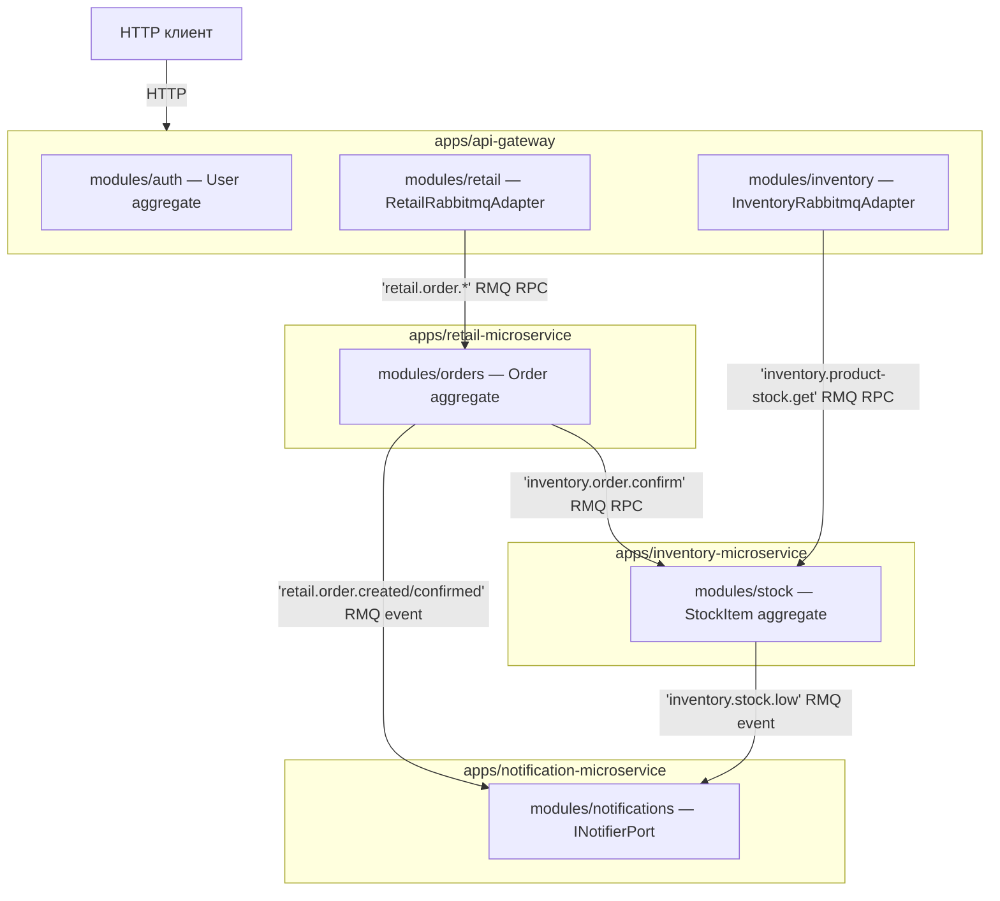

# Разделение на микросервисы

> [!abstract] Кратко
> Внутри монорепо живёт **четыре независимых процесса**: API gateway,
> retail-микросервис (заказы), inventory-микросервис (склад) и
> notification-микросервис (исходящие уведомления). Это распределение
> диктуется bounded-контекстами DDD, а не желанием иметь много
> сервисов: каждый микросервис владеет одной агрегат-моделью и
> единственной зоной ответственности. Транспорт между процессами —
> RabbitMQ (см. ADR-020), и это единственный разрешённый способ их
> общения. Микросервисный шаблон (ADR-004) распространяется на все
> четыре сервиса одинаково, даже если у gateway и notification сегодня
> почти нет своего домена.

## Проблема, которую решает

До миграции репозиторий был **одним gateway + двумя микросервисами без
общего рисунка**. Bounded-контексты existoвали неявно: «то, что про
заказы» оказывалось то в `retail-microservice`, то в gateway, то в
`libs/retail`. Inventory держал стоковую логику, но `IOrderProductConfirm`
жил в `libs/common/interfaces/`. Notification не существовал.

Это создавало конкретные проблемы:

- **Не было одного «места правды» для агрегата.** Когда retail
  создавал заказ, ему приходилось как минимум упомянуть `Product`
  (для line-items) — и эта «упоминалка» жила то в `OrderEntity`
  через `relations`, то в gateway-pipe, то в `libs/retail` (без
  владельца).
- **Сложно объяснить, что куда катится в деплое.** retail и inventory
  — это разные процессы, которые иногда стучатся друг к другу по
  RabbitMQ, но граница «здесь начинается чужая ответственность»
  компилятором не проверялась.
- **Уведомления растворились бы внутри retail.** Каждый сервис писал
  бы свои нотификации, путал бы их с бизнес-эвентами и зависел бы от
  чужих SMTP/webhook-настроек.

ADR-004 зафиксировал противоположный подход: **четыре сервиса — это
четыре bounded-контекста**, и архитектурный layout у всех одинаковый.
ADR-013 (для retail) и ADR-012 (для inventory) формализовали
агрегаты внутри каждого; ADR-011 построил notification с нуля как
**канонический шаблон**. ADR-020 зафиксировал RabbitMQ как единственный
транспорт между ними.

## Концепция

### Bounded context на сервис

Каждый сервис владеет **одним bounded-контекстом** в DDD-смысле:
ограниченным куском предметной области с собственными терминами,
инвариантами и persistence-моделью. Никакая чужая модель не пересекает
границу сервиса — только контрактные DTO из `libs/contracts`.

| Сервис                       | Bounded context                    | Главный агрегат / модель                              | Persistence    |
| ---------------------------- | ---------------------------------- | ----------------------------------------------------- | -------------- |
| `apps/api-gateway`           | Edge + Auth                        | `User` (внутри `modules/auth/`)                       | MySQL (только Auth) |
| `apps/retail-microservice`   | Orders (заказы и клиенты)          | `Order` (+ `OrderProduct`, `Customer`)                | MySQL          |
| `apps/inventory-microservice`| Stock (продукты и склад)           | `StockItem` (+ `Product`, `Storage`)                  | MySQL          |
| `apps/notification-microservice` | Outbound delivery              | `Notification` (value-object)                         | — (stateless)  |

«Один сервис — один контекст» — это решение, а не следствие.
Альтернативой был «один монолитный сервис», в котором все агрегаты
жили бы внутри одного процесса. Чем плохо:

- **Транзакции через границы.** Cross-contextual инварианты типа
  «подтвердить заказ можно только при достаточном стоке» легко
  превращаются в одну SQL-транзакцию через много таблиц. В DDD это
  считается ошибкой — каждый агрегат должен иметь свою транзакционную
  границу.
- **Релизный coupling.** Любое изменение в retail требует выкладки
  всего; изменение в notification — туда же.
- **Скейл-неоптимальность.** Inventory вычитывает стоки на каждый
  GET-product — это hot path; orders — write-heavy. В монолите они
  делят один пул соединений.

С монорепо-устройством мы получаем компромисс: **изолированные процессы
в деплое, общий код в репозитории** (см. [[nestjs-monorepo]]). У каждого
сервиса собственная сборка, собственный контейнер, собственная очередь
RabbitMQ, собственный список TypeORM-entity. Но `libs/contracts/retail/*`
видят и retail, и notification (поскольку notification потребляет события
ORDER_CREATED).

### Не «зачем-то много сервисов»

Распространённая ошибка с микросервисной архитектурой — **дробить
ради дробления**: «выделим payment в отдельный сервис, потому что это
важная штука». В нашем проекте границы проведены по объективным признакам:

- Разные **bounded-контексты** в смысле языка и инвариантов.
- Разный **профиль нагрузки** (stock GET — read-heavy; order POST —
  write-heavy; notification — fire-and-forget).
- Разный **доменный owner** (в живой команде retail и inventory
  ведут разные люди).

Если бы retail-orders и retail-customers были одним bounded-контекстом
с общими инвариантами — мы бы оставили их в одном сервисе. И мы так и
делаем: customers живёт *внутри* retail-микросервиса как часть модуля
`orders` (см. `OrderCreatePipe` → `customerExists()`), а не в отдельном
`customer-microservice`. Это сознательный отказ от ещё одного процесса.

### Шаблон на всех

ADR-004 говорит: «гексагональный layout применяется ко всем сервисам
одинаково, даже к тем, у кого почти нет домена». Зачем — если у
gateway бизнес-логики практически нет, а в notification её всего две
use-case'ы?

Потому что **архитектурный линт** (ADR-017, см. [[module-boundaries]])
работает только при едином шаблоне. Если каждый сервис разложен
по-своему, правила `eslint-plugin-boundaries` пришлось бы писать
четырьмя комплектами. С единым layout-ом:

- `domain/`, `application/`, `infrastructure/`, `presentation/` —
  одна и та же таксономия везде;
- порты и адаптеры везде называются одинаково;
- DI-токены везде symbol'ы;
- маппер на границе TypeORM — везде.

Notification идёт первым в migration-плане именно для того, чтобы
стать **canonical template** для retail и inventory (ADR-011): «вот
как должен выглядеть модуль; теперь скопируйте этот скелет в
`modules/stock/` и `modules/orders/`».

### RabbitMQ как seam

Между процессами разрешено общение **только через RabbitMQ** (ADR-020).
HTTP межсервисно — запрещён. Это даёт три свойства:

- **Producer/consumer decoupling.** retail не знает, что inventory
  существует — он эмитит `inventory.order.confirm` в очередь, и кто
  угодно может это слушать. Сегодня это inventory; завтра рядом
  может встать audit-сервис.
- **Producer не падает от падения consumer'а.** Если inventory
  упал, retail продолжает класть сообщения в очередь — RabbitMQ их
  буферизует.
- **Один транспорт для RPC и событий.** `ClientProxy.send` для
  RPC, `ClientProxy.emit` для fire-and-forget. Тот же `@nestjs/microservices`,
  тот же `Transport.RMQ`.

Cross-trace через четыре сервиса собирается единым деревом в Jaeger
благодаря `@opentelemetry/instrumentation-amqplib`, которое инжектит
`traceparent` в AMQP-properties (ADR-014). Это значит, что
`POST /api/order/123/confirm` оставляет один trace, проходящий через
gateway → retail → inventory → notification, без ручной плумбинг-кода.

## Применение в проекте

### Четыре `main.ts`

Сервис-граница на самом нижнем уровне — это четыре отдельных
точки входа. Каждый `main.ts` имеет одну общую первую строку
(см. [[opentelemetry-overview]]) и одну общую вторую (Pino-логгер
для bootstrap-фазы). Дальше шаблон расходится: gateway создаёт
HTTP-app, три микросервиса — RMQ-микросервис.

#### Gateway — HTTP-приложение

```typescript
// apps/api-gateway/src/main.ts
import '@retail-inventory-system/observability/tracer';

import { ValidationPipe } from '@nestjs/common';
// ...
((): void => {
  const logger = new PinoLogger(new LoggerModuleConfig(AppNameEnum.API_GATEWAY));
  void (async (): Promise<void> => {
    const app = await NestFactory.create(AppModule, { bufferLogs: true });
    // ...
    await app.listen(port);
  })().catch(/* ... */);
})();
```

> [GitHub: apps/api-gateway/src/main.ts](https://github.com/eugesher/retail-inventory-system/blob/84b1507c68fd9ee02b185eef3c4594b6fe02f664/apps/api-gateway/src/main.ts#L1-L49)

Gateway — единственный сервис, у которого есть **открытый HTTP-порт**.
`NestFactory.create()` (а не `createMicroservice()`) собирает Express-
приложение, навешивает глобальный `ValidationPipe` и слушает
`API_GATEWAY_PORT` (3000 по умолчанию).

#### Inventory / Retail / Notification — RMQ-only

```typescript
// apps/inventory-microservice/src/main.ts
import '@retail-inventory-system/observability/tracer';
// ...
const app = await NestFactory.createMicroservice<MicroserviceOptions>(AppModule, {
  bufferLogs: true,
  transport: Transport.RMQ,
  options: {
    urls: [configService.get<string>('RABBITMQ_URL')!],
    queue: MicroserviceQueueEnum.INVENTORY_QUEUE,
    queueOptions: { durable: true },
  },
});
await app.listen();
```

> [GitHub: apps/inventory-microservice/src/main.ts](https://github.com/eugesher/retail-inventory-system/blob/84b1507c68fd9ee02b185eef3c4594b6fe02f664/apps/inventory-microservice/src/main.ts#L1-L38)

Три микросервиса собираются через `NestFactory.createMicroservice` с
`Transport.RMQ`, привязывают **свою очередь** (`retail_queue`,
`inventory_queue`, `notification_events` — см. ADR-020) и слушают
сообщения. Никакого HTTP-порта они не открывают. Внешний мир может
дозвониться до них только через gateway, а внутренний — только через
RabbitMQ.

> [GitHub: apps/retail-microservice/src/main.ts](https://github.com/eugesher/retail-inventory-system/blob/84b1507c68fd9ee02b185eef3c4594b6fe02f664/apps/retail-microservice/src/main.ts#L1-L38)
>
> [GitHub: apps/notification-microservice/src/main.ts](https://github.com/eugesher/retail-inventory-system/blob/84b1507c68fd9ee02b185eef3c4594b6fe02f664/apps/notification-microservice/src/main.ts#L1-L39)

### Карта домена



- **Gateway** говорит HTTP наружу и RMQ внутрь. У него **нет**
  доменной модели за пределами модуля `auth` — модули `retail` и
  `inventory` на стороне gateway это **только** транспортные
  адаптеры, проксирующие в свои микросервисы (см. [[api-gateway-pattern]]).
- **Retail** владеет агрегатом `Order`. Чтобы подтвердить заказ,
  retail делает RPC `inventory.order.confirm` в inventory — это
  **межсервисный RPC**, оформленный через `IInventoryConfirmGatewayPort`
  (ADR-013).
- **Inventory** владеет агрегатом `StockItem`. Эмитит
  `inventory.stock.low` при низком остатке (ADR-012).
- **Notification** не владеет никаким persistence-state'ом — он
  слушает `retail.order.created` и `inventory.stock.low` и
  «дёргает» `INotifierPort` (сегодня это `LogNotifierAdapter`,
  завтра email/webhook — ADR-011).

### Один модуль на сервис

В наших трёх «настоящих» микросервисах сегодня **по одному модулю
на сервис**:

| Сервис        | Module path                                                          |
| ------------- | -------------------------------------------------------------------- |
| retail        | `apps/retail-microservice/src/modules/orders/`                       |
| inventory     | `apps/inventory-microservice/src/modules/stock/`                     |
| notification  | `apps/notification-microservice/src/modules/notifications/`          |

Структура у всех трёх **идентичная**:

```
modules/<name>/
├── domain/                     # aggregates, value objects, events, ports types
├── application/
│   ├── ports/                  # I*RepositoryPort, I*EventsPublisherPort, etc.
│   ├── use-cases/              # *.use-case.ts
│   └── dto/                    # *.command.ts, *.query.ts, *.view.ts
├── infrastructure/
│   ├── persistence/            # TypeORM entities, mappers, repositories
│   ├── messaging/              # RMQ adapters (publishers, consumers)
│   └── <module>.module.ts      # composition root for this module
└── presentation/
    ├── *.controller.ts         # @MessagePattern handlers
    ├── pipes/
    └── dto/
```

Notification — **canonical template** (ADR-011), на который смотрят
inventory (ADR-012) и retail (ADR-013) при написании своих модулей.
Это не значит, что внутри сервиса не может быть нескольких модулей —
gateway, например, имеет три: `auth`, `retail`, `inventory`. Это
значит лишь, что **минимум один модуль в каждом сервисе** обязан
быть, и он раскладывается ровно по четырём папкам.

### Граница: что НЕ переходит через RMQ

`libs/contracts` — единственный способ для одного сервиса узнать о
типе из другого. Domain-классы (`Order`, `StockItem`, `Notification`)
**никогда** не пересекают границу процесса:

- **Доменная модель приватна для сервиса.** `Order` живёт только
  внутри retail-микросервиса; inventory о нём ничего не знает.
- **На проводе летят DTO.** Когда retail вызывает
  `inventory.order.confirm`, payload — это `IOrderProductConfirm[]`
  из `@retail-inventory-system/contracts/retail/`. Не `Order`,
  не `OrderEntity`, а плоская структура с `productId`, `quantity`,
  `orderId`.
- **Маппер на каждой границе.** В адаптере межсервисного RPC лежит
  трансформация «domain → wire DTO» (на стороне retail) и
  «wire DTO → domain» (на стороне inventory). Никакой `Order` не
  сериализуется как есть.

Это и есть тот самый barrier, который удерживает domain-чистоту
при наличии межсервисной коммуникации: см. ADR-013 и
[[mappers-and-repositories]].

## Связанные решения

- [[nestjs-monorepo]] — почему все четыре сервиса живут в одном
  репозитории, несмотря на то что в деплое они независимые процессы.
- [[api-gateway-pattern]] — детальный разбор роли gateway, того, что
  он *делает*, и того, чего сознательно **не** делает.
- [[shared-libs-philosophy]] — какие именно общие библиотеки живут в
  `libs/*` и почему каждая из них существует.
- [[hexagonal-architecture]] — внутренний layout, который применяется
  ко всем четырём сервисам одинаково.

## Глоссарий

| Термин (EN)             | Перевод / пояснение (RU)                                                                                                                                                                                            |
| ----------------------- | ------------------------------------------------------------------------------------------------------------------------------------------------------------------------------------------------------------------ |
| Microservice            | Деплоимый процесс с собственным bounded-контекстом, своей очередью RMQ и своим набором сущностей. У нас три: retail, inventory, notification.                                                                       |
| Bounded context         | Граница языка предметной области в DDD. Один сервис = один bounded-контекст; чужая модель не пересекает границу.                                                                                                    |
| API Gateway             | Edge-сервис с открытым HTTP-портом. Аутентификация + проксирование RPC к микросервисам. Не имеет своей бизнес-логики (кроме модуля `auth`).                                                                          |
| RMQ-only service        | Сервис, у которого нет HTTP-порта; общение с внешним миром только через RabbitMQ. У нас это retail, inventory, notification.                                                                                         |
| Bus / Message bus       | RabbitMQ — единственный транспорт между процессами. ADR-020 запрещает прямой HTTP-trafic между сервисами.                                                                                                            |
| Canonical template      | Notification-микросервис, шаблон, по которому равняются модули `stock/` (inventory) и `orders/` (retail). См. ADR-011.                                                                                              |
| Per-module hexagonal    | Layout `domain / application / infrastructure / presentation` внутри каждого `modules/<name>/`. Применяется ко всем четырём сервисам одинаково.                                                                       |
| Queue per service       | Соглашение «у каждого сервиса своя очередь RMQ»: `retail_queue`, `inventory_queue`, `notification_events`. Имена объявлены в `MicroserviceQueueEnum` (libs/contracts/microservices).                                  |
| Cross-service RPC       | `ClientProxy.send(pattern, payload)` между двумя микросервисами. Сегодня единственный пример — `inventory.order.confirm` от retail к inventory (ADR-013).                                                            |
| Cross-service event     | `ClientProxy.emit(pattern, payload)` — fire-and-forget. Notification слушает `retail.order.created` и `inventory.stock.low`.                                                                                         |

## Что почитать дальше

- [ADR-004](https://github.com/eugesher/retail-inventory-system/blob/84b1507c68fd9ee02b185eef3c4594b6fe02f664/docs/adr/004-adopt-hexagonal-architecture-per-service.md)
  — фиксация гексагонального layout-а для всех четырёх сервисов.
- [ADR-020](https://github.com/eugesher/retail-inventory-system/blob/84b1507c68fd9ee02b185eef3c4594b6fe02f664/docs/adr/020-rabbitmq-as-inter-service-bus.md)
  — выбор RabbitMQ как seam'а между сервисами; рассмотренные
  альтернативы (Kafka, NATS, gRPC, прямой HTTP).
- [ADR-011](https://github.com/eugesher/retail-inventory-system/blob/84b1507c68fd9ee02b185eef3c4594b6fe02f664/docs/adr/011-notifier-port-and-adapters.md),
  [ADR-012](https://github.com/eugesher/retail-inventory-system/blob/84b1507c68fd9ee02b185eef3c4594b6fe02f664/docs/adr/012-stock-aggregate-and-port-adapter.md),
  [ADR-013](https://github.com/eugesher/retail-inventory-system/blob/84b1507c68fd9ee02b185eef3c4594b6fe02f664/docs/adr/013-order-aggregate-and-cross-service-confirm.md)
  — три ADR, фиксирующие layout каждого из настоящих микросервисов.
- Eric Evans — *Domain-Driven Design* (Addison-Wesley, 2003), Part IV
  «Strategic Design» — концепция bounded-контекстов в её каноничной
  форме.

> [!faq]- Проверь себя
>
> 1. Почему gateway создаётся через `NestFactory.create`, а три
>    остальных сервиса — через `NestFactory.createMicroservice`?
>    Что это меняет в runtime-сурфейсе?
> 2. Сколько модулей сегодня живёт в retail-микросервисе? А в
>    notification? Что мешает добавить ещё один?
> 3. Можно ли отправить `Order` (domain-модель) в RabbitMQ-сообщении
>    `retail.order.created`? Почему нет?
> 4. У retail- и inventory-микросервиса — общий код в `libs/contracts`.
>    Что произойдёт, если изменить там DTO и закоммитить только
>    retail-часть? Когда и как это поймается?
> 5. Где живёт логика «отправить уведомление о созданном заказе» —
>    в retail-микросервисе или в notification-микросервисе? Почему?
