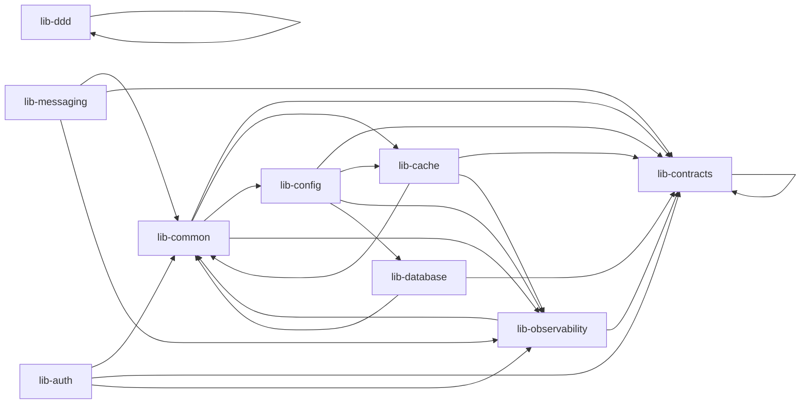

# Философия общих библиотек

> [!abstract] Кратко
> В `libs/` живёт **девять покрытых ADR-5 «настоящих» библиотек**
> (`contracts`, `database`, `ddd`, `messaging`, `cache`, `observability`,
> `auth`, `common`, `config`) — плюс точки соприкосновения с
> компилятором (`tsconfig.json` `paths`). Каждая lib имеет одну
> зафиксированную ответственность и **жёсткий список того, что
> запрещено импортировать**. Domain-код не имеет права тянуть NestJS;
> `lib-contracts` не имеет права тянуть TypeORM; `lib-ddd` framework-
> free. Эти запреты — не пожелания: они — правила
> `eslint-plugin-boundaries`, проверяемые в `yarn lint`. Таксономия
> зафиксирована в ADR-005; ADR-017 делает её обязательной.

## Проблема, которую решает

До миграции репозиторий имел четыре lib-а: `common`, `config`,
`inventory`, `retail`. Из них `libs/common` представлял собой
типичную «свалку»: routing-enum'ы для микросервисов лежали рядом с
`@nestjs/microservices`-модулями, рядом с middleware корреляции, рядом
с кэш-хелпером, рядом с `IOrderProductConfirm`. Любой консьюмер
одного enum'а транзитивно подтягивал в дерево импорта NestJS,
RabbitMQ-клиента, Redis-обёртку.

Для гексагональной архитектуры (см. [[hexagonal-architecture]]) это
оказалось неподъёмно. Цель ADR-004 — «`domain/` не зависит ни от
NestJS, ни от TypeORM». Но если `domain/` нужен `OrderStatusEnum`, и
этот enum лежит в `libs/common` рядом с `@nestjs/microservices`-модулями,
обходных путей у домена нет: даже импорт *одного* типа протягивает
**всё дерево** транзитивных зависимостей.

ADR-005 разрубил этот узел. Вместо одной грязной `libs/common` —
девять чётко-разделённых libs, каждая со своей ответственностью и
своим набором запретов:

- `contracts` — pure-TypeScript, доменные DTO и cross-service enum'ы;
- `ddd` — framework-free примитивы `Entity`/`AggregateRoot`/`VO`;
- `database` — TypeORM-обвязка;
- `messaging` — RabbitMQ-обвязка;
- `cache` — Redis-обвязка;
- `observability` — Pino + OTel + correlation;
- `auth` — JWT + RBAC framework-glue;
- `common` — оставшийся каркас (`Result`, `DomainException`, `IPage`);
- `config` — Joi-схема env'ов.

Эта таксономия — основа архитектурного линта (ADR-017,
[[module-boundaries]]).

## Концепция

### Одна lib — одна ответственность

Каждая `libs/<name>/` отвечает **за одно** концептуальное направление.
Это не «один npm-пакет = одна папка»: внутри `libs/observability`
живёт и Pino-обвязка, и OTel-bootstrap, и middleware для correlation
ID. Они едины в смысле ответственности — «как мы видим, что
происходит в системе» — поэтому живут вместе.

Главный критерий «вместе или раздельно?»: **общий ли набор запретов**.
`libs/contracts` и `libs/ddd` не могут импортировать NestJS, TypeORM
и любую I/O-библиотеку — но это разные запреты. `contracts`
разрешён `class-validator` и `@nestjs/swagger` (потому что contracts
есть HTTP/RPC-DTO, и эти декораторы нужны для генерации OpenAPI).
`ddd` — не разрешён ни `class-validator`, ни Nest-декораторы вообще.
Поэтому они — две lib'ы, не одна.

### Forbidden imports — правило, а не пожелание

`CLAUDE.md` содержит раздел **Forbidden imports**, который в одной
строке описывает, чего домен не имеет права импортировать:

> Domain code (under `apps/*/src/.../domain/` and inside `libs/ddd`)
> MUST NOT import from `@retail-inventory-system/messaging`,
> `@retail-inventory-system/cache`,
> `@retail-inventory-system/observability`,
> `@retail-inventory-system/database`, or any `@nestjs/*` package.

Это не «договорённость в код-ревью», а **исполняемая истина**: рядом
с `CLAUDE.md` живёт `eslint.config.mjs`, в котором каждый запрет
переведён в правило `boundaries/dependencies`.

```javascript
// eslint.config.mjs
// Lib edges — kept narrow on purpose (ADR-017 §3).
{ from: { type: 'lib-ddd' }, allow: [lib('lib-ddd')] },
{ from: { type: 'lib-contracts' }, allow: [lib('lib-contracts')] },
{
  from: { type: 'lib-common' },
  allow: [
    lib('lib-common'),
    lib('lib-contracts'),
    lib('lib-cache'),
    lib('lib-config'),
    lib('lib-observability'),
  ],
},
// ...
```

> [GitHub: eslint.config.mjs](https://github.com/eugesher/retail-inventory-system/blob/84b1507c68fd9ee02b185eef3c4594b6fe02f664/eslint.config.mjs#L217-L264)

Каждая lib определена через element-type `lib-<name>`:

```javascript
// eslint.config.mjs
{ type: 'lib-auth',          pattern: 'libs/auth/**',          mode: 'file' },
{ type: 'lib-cache',         pattern: 'libs/cache/**',         mode: 'file' },
{ type: 'lib-common',        pattern: 'libs/common/**',        mode: 'file' },
{ type: 'lib-config',        pattern: 'libs/config/**',        mode: 'file' },
{ type: 'lib-contracts',     pattern: 'libs/contracts/**',     mode: 'file' },
{ type: 'lib-database',      pattern: 'libs/database/**',      mode: 'file' },
{ type: 'lib-ddd',           pattern: 'libs/ddd/**',           mode: 'file' },
{ type: 'lib-messaging',     pattern: 'libs/messaging/**',     mode: 'file' },
{ type: 'lib-observability', pattern: 'libs/observability/**', mode: 'file' },
```

> [GitHub: eslint.config.mjs](https://github.com/eugesher/retail-inventory-system/blob/84b1507c68fd9ee02b185eef3c4594b6fe02f664/eslint.config.mjs#L62-L70)

И в правилах сверху сформулировано «`lib-ddd` может импортировать
только сам себя; никаких других libs, никаких NestJS, никаких I/O».
Если завтра разработчик попробует затянуть Pino в `libs/ddd`, `yarn lint`
завалит CI.

Это и есть **философия общих библиотек** в одной фразе: **не «что
можно положить рядом», а «что запрещено затащить транзитивно»**.

### Зачем девять, а не три

Можно было бы свернуть всё в три lib'ы: `contracts`, `infrastructure`,
`utils`. Это плохо по двум причинам:

- **Слишком грубая таксономия для линта.** Если `lib-infrastructure`
  содержит и TypeORM, и RabbitMQ, и Redis — у use-case'а нет способа
  сказать «можешь импортировать сообщения, но не БД». А именно такая
  гранулярность нужна. С девятью lib'ами use-case импортирует
  `lib-contracts`, `lib-common`, `lib-auth` — и **ничего больше**.
  Архитектурный линт может это проверить (см. правило
  `from.type='application-use-case'` в `eslint.config.mjs`).
- **Слишком грубая ответственность.** Когда нужно поменять что-то про
  observability, открыть-закрыть один файл `libs/observability/logger.module.ts`
  гораздо понятнее, чем рыться в гипотетической `libs/infrastructure/`
  на 20 файлов.

### Sequence: foundation → integration → auth

ADR-005 разводит lib-split на **три волны**:

| Волна       | Задача          | Lib'ы                                             |
| ----------- | --------------- | ------------------------------------------------- |
| Foundation  | task-03         | `contracts`, `database`, тонкий `common`           |
| Integration | task-04         | `messaging`, `cache`, `observability`, `ddd`       |
| Auth        | task-06         | `auth`                                             |

Это решение «foundation идёт первым». Foundation libs — это
**инфраструктурный фундамент для всех остальных**: ни один
`libs/messaging` не может существовать без `libs/contracts` (он
импортирует `MicroserviceQueueEnum`); ни один `libs/database` не
может существовать без `libs/common` (он зависит от `Result` и
`DomainException`). Поэтому foundation — это та lib-волна, которая
**не имеет внешних зависимостей друг на друга**, а только на
external-пакеты.

### Граф зависимостей между lib'ами

Этот граф — узкий по дизайну (ADR-017 §3):



Видно, что `contracts` и `ddd` — **листья** (никого не импортируют
из соседних libs); `common` зависит от `contracts`; всё остальное
зависит от `common` + `contracts` + по необходимости `observability`.
Циклов нет; линт это проверяет.

## Применение в проекте

Ниже — однострочные ответы на «зачем эта lib» + что она **забыла
сделать**.

### `lib-contracts` — cross-service контракты

```typescript
// libs/contracts/index.ts
export * from './auth';
export * from './inventory';
export * from './microservices';
export * from './retail';
```

> [GitHub: libs/contracts/index.ts](https://github.com/eugesher/retail-inventory-system/blob/84b1507c68fd9ee02b185eef3c4594b6fe02f664/libs/contracts/index.ts#L1-L5)

- **Содержит.** DTO заказов, DTO стока, `RoleEnum`, `ICurrentUser`,
  `IJwtAccessPayload`, `IJwtRefreshPayload`, queue/pattern/client-token-
  enum'ы для микросервисов, `ICorrelationPayload`.
- **Запрещено.** Любой `@nestjs/*` (кроме `@nestjs/swagger` —
  для OpenAPI), любой TypeORM, любой `amqplib`, любой Redis.
- **Почему так строго.** `lib-contracts` — это тот тип, который
  `domain/` имеет право импортировать. Если бы там жил NestJS-импорт,
  domain транзитивно тянул бы Nest. Запрет — единственный способ
  гарантировать чистоту.

### `lib-ddd` — framework-free доменные примитивы

```typescript
// libs/ddd/index.ts
export * from './aggregate-root.base';
export * from './domain-event.base';
export * from './entity.base';
export * from './repository.port';
export * from './value-object.base';
```

> [GitHub: libs/ddd/index.ts](https://github.com/eugesher/retail-inventory-system/blob/84b1507c68fd9ee02b185eef3c4594b6fe02f664/libs/ddd/index.ts#L1-L5)

- **Содержит.** `Entity<TId>`, `AggregateRoot<TId>`, `ValueObject<TProps>`,
  `DomainEvent<TAggregateId>`, `IRepositoryPort<TAggregate, TId>`.
- **Запрещено.** Вообще всё: NestJS, TypeORM, любой I/O, любой logger,
  `class-validator`. Список disallowance — самый широкий из всех libs.
- **Почему так строго.** `lib-ddd` — фундамент `domain/`-слоя. Если
  бы тут жил Nest-декоратор, гексагональная цель схлопнулась бы.

### `lib-common` — каркас «без фреймворка»

```typescript
// libs/common/index.ts
export * from './exceptions';
export * from './pagination';
export * from './result';
export * from './types';
```

> [GitHub: libs/common/index.ts](https://github.com/eugesher/retail-inventory-system/blob/84b1507c68fd9ee02b185eef3c4594b6fe02f664/libs/common/index.ts#L1-L8)

- **Содержит.** `Result<T, E>` discriminated union, `DomainException`,
  `IPage<T>` / `IPageRequest`, утилитные `Maybe<T>` / `Nullable<T>`.
- **Запрещено.** То же, что для ddd, плюс messaging/database/auth.
- **Не путать с предыдущим `libs/common`.** До миграции там лежали
  и cache-helper, и RMQ-client-модули, и middleware. После task-03
  это всё переехало в специализированные libs; `libs/common` стал
  тонким каркасом.

### `lib-database` — TypeORM-обвязка

```typescript
// libs/database/index.ts
export * from './base.entity';
export * from './base-typeorm.repository';
export * from './database.module';
export * from './snake-naming.strategy';
```

> [GitHub: libs/database/index.ts](https://github.com/eugesher/retail-inventory-system/blob/84b1507c68fd9ee02b185eef3c4594b6fe02f664/libs/database/index.ts#L1-L4)

- **Содержит.** `BaseEntity` (PK + createdAt/updatedAt/deletedAt),
  `BaseTypeormRepository<TEntity, TDomain>`, `DatabaseModule.forRoot/forFeature`,
  re-export `SnakeNamingStrategy` из `typeorm-naming-strategies`.
- **Запрещено.** Сервисные модули не должны конструировать
  `TypeormModuleConfig` напрямую. Все вызовы — через
  `DatabaseModule.forRoot(entities)`.

### `lib-messaging` — RabbitMQ-обвязка

```typescript
// libs/messaging/index.ts
export * from './exchanges.constants';
export * from './messaging.module';
export * from './microservice-client-inventory.module';
export * from './microservice-client-notification.module';
export * from './microservice-client-retail.module';
export * from './microservice-client.configuration';
export * from './rabbitmq.client.factory';
export * from './routing-keys.constants';
// Re-exports MicroserviceClientTokenEnum, MicroserviceQueueEnum from contracts.
```

> [GitHub: libs/messaging/index.ts](https://github.com/eugesher/retail-inventory-system/blob/84b1507c68fd9ee02b185eef3c4594b6fe02f664/libs/messaging/index.ts#L1-L17)

- **Содержит.** `ROUTING_KEYS` (dotted `<service>.<aggregate>.<action>`),
  `EXCHANGES` (зарезервированы под топик-роутинг), `MicroserviceClient{Retail,Inventory,Notification}Module`,
  `RabbitmqClientFactory`.
- **Запрещено импортировать в pres./use-case/domain.** Импорт `lib-messaging`
  разрешён только из presentation (`ROUTING_KEYS`-константы) и
  infrastructure (полная обвязка). Use-case'ы — нет.

### `lib-cache` — Redis-обвязка

- **Содержит.** `ICachePort` (`get/set/del/wrap/delByPrefix`),
  `CACHE_PORT` (DI-токен), `RedisCacheAdapter`, `CacheModule` (`@Global()`),
  `@Cacheable()`-декоратор, `CACHE_KEYS` (типизированные builders по
  правилу `ris:<service>:<aggregate>:<id>[:<facet>]` — ADR-016).
- **Запрещено.** Апы не должны напрямую импортировать `@nestjs/cache-manager`,
  `@keyv/redis`, `cacheable` — только `ICachePort`/`CACHE_PORT`.
- **Запрещено.** Cache-key string literals в `apps/*`. Только builders
  из `CACHE_KEYS`.

### `lib-observability` — Pino + OTel + correlation

- **Содержит.** `LoggerModuleConfig` (Pino с redaction, transport,
  `logMethod` hook для trace correlation — ADR-015), `CorrelationMiddleware`,
  `@CorrelationId()` decorator, OTel `tracer.ts` (deep-import side-effect),
  `TraceContextInterceptor` (placeholder), `MetricsModule` (placeholder).
- **Особая deep-import-точка.** `tracer.ts` экспортируется через
  отдельный path-alias `@retail-inventory-system/observability/tracer`
  и должен быть **первой** строкой каждого `main.ts` — иначе
  auto-instrumentation не успевает пропатчить HTTP/TypeORM/Redis/amqplib
  (ADR-014).

### `lib-auth` — JWT + RBAC framework glue

```typescript
// libs/auth/index.ts
export * from './auth-user-validator.port';
export * from './auth.module';
export * from './current-user.decorator';
export * from './jwt-auth.guard';
export * from './jwt.strategy';
export * from './public.decorator';
export * from './role.enum';
export * from './roles.decorator';
export * from './roles.guard';
```

> [GitHub: libs/auth/index.ts](https://github.com/eugesher/retail-inventory-system/blob/84b1507c68fd9ee02b185eef3c4594b6fe02f664/libs/auth/index.ts#L1-L9)

- **Содержит.** `AuthModule.forRootAsync({ imports, providers, exports })`,
  `JwtStrategy`, `JwtAuthGuard`, `RolesGuard`, `@Public`, `@Roles`,
  `@CurrentUser`, `AUTH_USER_VALIDATOR` port-symbol, runtime re-export
  `RoleEnum`.
- **Особое.** Lib-auth содержит **только framework-glue**. Хранилище
  пользователей (`User` aggregate, `UserEntity`, `argon2`-хешер,
  use-case'ы Login/Refresh/Logout/Register) живут в
  `apps/api-gateway/src/modules/auth/`. См. ADR-010 и
  [[jwt-and-rbac]].

### `lib-config` — Joi-схема env'ов

```typescript
// libs/config/index.ts
export * from './config-module.config';
```

> [GitHub: libs/config/index.ts](https://github.com/eugesher/retail-inventory-system/blob/84b1507c68fd9ee02b185eef3c4594b6fe02f664/libs/config/index.ts#L1-L1)

- **Содержит.** `configModuleConfig` — конфиг для `ConfigModule.forRoot()`
  c Joi-схемой всех env-переменных проекта.
- **Запрещено.** Магические `process.env.X` в апах. Каждая env должна
  пройти через Joi-валидацию здесь.

### Правило для апов: разделение по слою импорта

Когда апу нужен общий код, выбор lib'ы определяется **слоем**, в котором
будет жить импортирующий файл:

| Слой                                | Может импортировать                                                   |
| ----------------------------------- | --------------------------------------------------------------------- |
| `domain/`                           | `lib-ddd`, `lib-common`, `lib-contracts`                              |
| `application/use-cases/`            | `lib-ddd`, `lib-common`, `lib-contracts`, `lib-auth` (только interface) |
| `application/ports/`                | `lib-ddd`, `lib-contracts`                                            |
| `application/dto/`                  | `lib-contracts` (+ domain-типы)                                       |
| `infrastructure/`                   | все libs                                                              |
| `presentation/`                     | `lib-auth`, `lib-contracts`, `lib-messaging` (только `ROUTING_KEYS`), `lib-observability` |
| `apps/<svc>/src/main.ts`, `app/*`   | все libs (app-bootstrap = composition root)                            |

> [GitHub: eslint.config.mjs](https://github.com/eugesher/retail-inventory-system/blob/84b1507c68fd9ee02b185eef3c4594b6fe02f664/eslint.config.mjs#L113-L216)

Это и есть тот «забор», который удерживает гексагональный layout от
схлопывания: правило 0 в `eslint-plugin-boundaries` —
`default: 'disallow'`, поэтому **любое ребро должно быть явно
разрешено**. Если разработчик пытается из `application/ports/`
импортировать `lib-cache` — линт его остановит, потому что нет
allow-правила для этой пары.

## Связанные решения

- [[nestjs-monorepo]] — как `libs/` устроены физически (TS-path-алиасы,
  не Yarn-воркспейсы), и почему их девять, а не пять и не пятнадцать.
- [[microservices-split]] — какие из девяти libs импортирует каждый
  из четырёх сервисов и зачем.
- [[api-gateway-pattern]] — как gateway собирает себя из `lib-auth`,
  `lib-contracts`, `lib-messaging`, `lib-observability`, `lib-config`,
  `lib-database`.
- [[module-boundaries]] — глубокое описание правил
  `eslint-plugin-boundaries`, на которых стоит вся таксономия libs.
- [[architecture-decision-records]] — ADR-005 как формальная фиксация
  таксономии; ADR-017 как фиксация её исполнения через линт.

## Глоссарий

| Термин (EN)               | Перевод / пояснение (RU)                                                                                                                                                              |
| ------------------------- | ------------------------------------------------------------------------------------------------------------------------------------------------------------------------------------- |
| Shared library            | Папка `libs/<name>/` с переиспользуемым кодом, импортируемая по path-алиасу `@retail-inventory-system/<name>`.                                                                            |
| TS path alias             | Запись в `compilerOptions.paths` `tsconfig.json`. У нас десять алиасов (плюс deep-import `…/observability/tracer`).                                                                       |
| Forbidden imports         | Раздел `CLAUDE.md`, словесно описывающий, что нельзя импортировать в `domain/`. Дублирует часть правил `eslint-plugin-boundaries` для людей.                                              |
| Element type              | Категория файла в `eslint-plugin-boundaries`. У нас тип на каждую lib (`lib-contracts`, `lib-ddd`, …) плюс слоистые типы для `apps/*`.                                                  |
| Foundation libs           | `lib-contracts`, `lib-database`, тонкий `lib-common`. Делаются в task-03; нужны как фундамент для остальных libs.                                                                        |
| Integration libs          | `lib-messaging`, `lib-cache`, `lib-observability`, `lib-ddd`. Делаются в task-04; опираются на foundation.                                                                                |
| `boundaries/dependencies` | Правило v6 из `eslint-plugin-boundaries`. Описывает граф разрешённых импортов между element-types. `default: 'disallow'` запрещает всё, что не разрешено явно.                            |
| `lib-ddd`                 | Тип `eslint-plugin-boundaries` для `libs/ddd/**`. Имеет самый строгий disallow-лист — никакого NestJS, никакого I/O, никакого `class-validator`.                                          |
| `lib-contracts`           | Тип для `libs/contracts/**`. Разрешён `class-validator`, `class-transformer`, `@nestjs/swagger` (потому что contracts являются HTTP/RPC DTO-формой).                                      |
| Deep import               | Импорт по более длинному path-алиасу: `@retail-inventory-system/observability/tracer`. У нас это **единственный** deep-import; нужен для отдельной точки side-effect-инициализации OTel. |

## Что почитать дальше

- [ADR-005](https://github.com/eugesher/retail-inventory-system/blob/84b1507c68fd9ee02b185eef3c4594b6fe02f664/docs/adr/005-split-shared-common-into-bounded-libs.md)
  — таксономия девяти libs, рассмотренные альтернативы (per-lib
  `package.json`, fat `common`, скип `DatabaseModule`).
- [ADR-017](https://github.com/eugesher/retail-inventory-system/blob/84b1507c68fd9ee02b185eef3c4594b6fe02f664/docs/adr/017-architecture-lint-via-eslint-boundaries.md)
  — как таксономия закреплена в `eslint-plugin-boundaries` v6,
  fixture-spec, документированное исключение `ARCH-LINT-EX-01`.
- `CLAUDE.md` § «Shared Libraries» — словесная таблица того, что
  каждая lib содержит и за что отвечает.
- Vaughn Vernon — *Implementing Domain-Driven Design* (Addison-Wesley,
  2013), глава 9 «Modules» — концепция модульного разделения вокруг
  bounded-контекстов; наша lib-таксономия — её прикладная инстанция.

> [!faq]- Проверь себя
>
> 1. Сколько сегодня lib'ов в `libs/`? Какие из них могут импортировать
>    `@nestjs/common`, а какие — нет?
> 2. В чём разница между `libs/ddd` и `libs/common`? Что общего и где
>    проходит граница ответственности?
> 3. Почему `libs/contracts` разрешено импортировать `class-validator`
>    и `@nestjs/swagger`, но запрещено `@nestjs/common`? Какой
>    конкретный сценарий это обслуживает?
> 4. Где живёт `tracer.ts` и почему он экспортируется через **deep
>    import** `@retail-inventory-system/observability/tracer`, а не
>    через общий `@retail-inventory-system/observability` index?
> 5. Если разработчик в `application/ports/order.repository.port.ts`
>    попробует импортировать `Repository<OrderEntity>` из `typeorm`,
>    что произойдёт? Какое правило линта это поймает?
